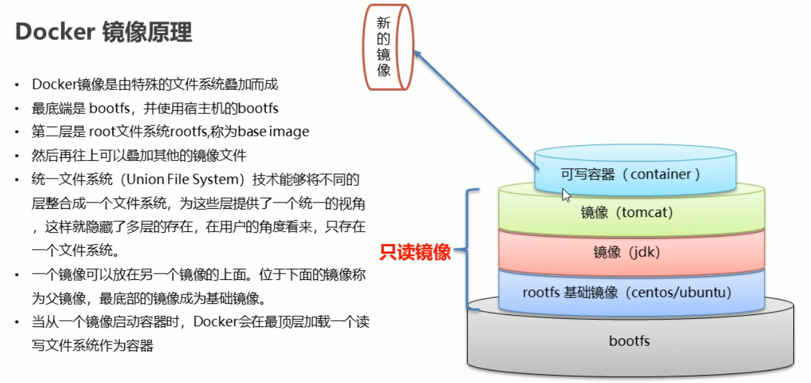

Docker 镜像文件
===
镜像是一种轻量级、可执行的独立软件包，用来打包软件运行环境和基于运行环境开发的软件，它包含运行某个软件所需的所有内容，包括代码、运行时、库、环境变量和配置文件。


### UnionFS

UnionFS（联合文件系统）: Union文件系统（UnionFS）是一种分层、轻量级并且高性能的文件系统，它支持对文件系统的修改作为一次提交来一层层的叠加，同时可以将不同目录挂载到同一个虚拟文件系统下(unite several directories into a single virtual filesystem)。

Union 文件系统是 Docker 镜像的基础。镜像可以通过分层来进行继承，基于基础镜像（没有父镜像），可以制作各种具体的应用镜像。

### 镜像加载原理

Docker的镜像实际上<big>由一层一层的文件系统组成</big>，这种层级的文件系统UnionFS。

Bootfs(boot file system)主要包含Bootloader和Kernel, Bootloader主要是引导加载Kernel, Linux刚启动时会加载Bootfs文件系统，在Docker镜像的最底层是bootfs。这一层与我们典型的Linux/Unix系统是一样的，包含Boot加载器和内核。当boot加载完成之后整个内核就都在内存中了，此时内存的使用权已由bootfs转交给内核，此时系统也会卸载bootfs。

Rootfs (root file system) ，在Bootfs之上。包含的就是典型 Linux 系统中的 /dev, /proc, /bin, /etc 等标准目录和文件。Rootfs就是各种不同的操作系统发行版，比如Ubuntu，Centos等等。

* 分层结构的特点

  最大的一个好处就是共享资源

  比如：有多个镜像都从相同的 base 镜像构建而来，那么宿主机只需在磁盘上保存一份base镜像，<mark>同时内存中也只需加载一份 base 镜像</mark>，就可以为所有容器服务了。而且镜像的每一层都可以被共享。
### 镜像操作

  通过修改container (容器)内容 创建新 image (镜像)

  `docker commit -m="要提交的描述信息" -a="作者" 容器ID 要创建的目标镜像名:[标签名]`
  * 创建容器并启动
    ```shell
    docker run -it -p 8888:8080 tomcat
    ```

    | 参数 | 说明                    |
    | ---- | ----------------------- |
    | -p   | 宿主机端口:docker容器端口 |
    | -P   | 随机分配端口            |
    | -i   | 交互                    |
    | -t   | 终端                    |
  * 通过终端修改容器内容
    ```shell
    docker exec -it 容器ID /bin/bash
    ```  
  * 创建新镜像

    提交修改后的容器 创建成为新的镜像

    ```shell
    docker commit -a='milk' -m='add index.html' 容器ID milk/tomcat:1.0
    ```  
  * 启动新镜像
    ```shell
    docker run -it -p 8080:8080 milk/tomcat:1.0
    ```  