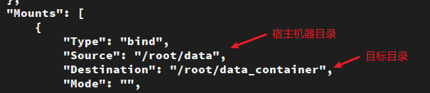
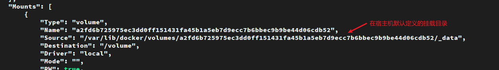

容器数据卷
===
## 数据卷概念 与 作用
### 数据卷概念
* 数据卷是宿主机中的一个目录或文件
* 当容器目录和数据卷目录绑定后，对方的修改会立即同步
* 同一个数据卷可以被多个容器同时挂载
* 同一个容器也可以被挂载多个数据卷
### 数据卷作用
* 容器数据持久化
* 外部机器和容器间接通信
* 容器之间数据交换
## 配置数据卷
### 启动参数配置 数据卷
* 创建启动容器时，使用 –v 参数 设置数据卷
  ```shell
  docker run ... –v 宿主机目录(文件):容器内目录(文件) ... 

  docker run -it --name=c1 -v /root/data:/root/data_container centos:7 /bin/bash
  ```
  * 注意事项：
    1. 目录必须是绝对路径
    1. 如果目录不存在，会自动创建
    1. 可以挂载多个数据卷
  * 挂载多个目录
    ```shell
    docker run -it --name=c2 \
    -v ~/data2:/root/data2 \
    -v ~/data3:/root/data3 \
    centos:7
    ```  
  * 查看数据卷挂载信息
    ```shell
    docker inspect 容器ID
    ```  
    
    

    
### 数据卷容器
* 创建启动c3数据卷容器，使用 –v 参数 设置数据卷
  ```shell
  docker run –it --name=c3 –v /volume centos:7 /bin/bash   
  ```

  只定义 `/volume` 在宿主机上会创建一个默认的目录挂载

  

* 创建启动 c1 c2 容器，使用 `--volumes-from` 参数 设置数据卷
  ```shell
  docker run –it --name=c1 --volumes-from c3 centos:7 /bin/bash

  docker run –it --name=c2 --volumes-from c3 centos:7 /bin/bash  
  ```   

  c1 c2 使用 `docker inspect` 查询的宿主目录与 c3相同


