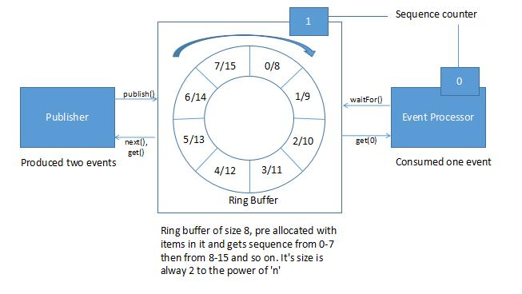

Disruptor
===
> Disruptor 是一个提供并发环形缓冲区数据结构的库。它旨在在异步事件处理架构中提供低延迟、高吞吐量的工作队列。

* [主页](https://lmax-exchange.github.io/disruptor/)
* [github](https://github.com/LMAX-Exchange/disruptor)
* [Getting Started 入门](https://lmax-exchange.github.io/disruptor/user-guide/index.html#_getting_started)
* [官方 example](https://github.com/LMAX-Exchange/disruptor/tree/master/src/examples/java/com/lmax/disruptor/examples)
* [Disruptor 系列（一）快速入门](https://www.cnblogs.com/binarylei/p/9221547.html)
* [Disruptor 系列（二）使用场景](https://www.cnblogs.com/binarylei/p/9221560.html)
* [高性能队列——Disruptor 美团技术博客](https://tech.meituan.com/2016/11/18/disruptor.html)
* [Disruptor多个消费者不重复处理生产者发送过来的消息](https://www.cnblogs.com/linjiqin/p/7466064.html)
## 特性

* RingBuffer是一个环形队列

* RingBuffer的序号，指向下一个可用的元素

* 采用数组实现，没有首尾指针

* 对比ConcurrentLinkedQueue，用数组实现的速度更快

  假如长度为8，当添加到第12个元素的时候在哪个序号上呢？用12%8决定

  当Buffer被填满的时候到底是覆盖还是等待，由Produce决定

  长度设为2的n次幂，利于二进制计算，例如：12%8=12&（8-1）
## 速览
* Lambda表达式写法
  ```java
  // 指定环缓冲区的大小，必须为2的幂。
  int bufferSize = 1 << 3;
  //指定消费线程工厂
  ThreadFactory consumerThreadFactory = new ThreadFactoryBuilder()
            .setNamePrefix("consumer-pool-")
            .build();
  //构建Disruptor 定义队列中的事件类型
  Disruptor<LongEvent> disruptor = new Disruptor<>(LongEvent::new, bufferSize, consumerThreadFactory);
  //关联处理器 EventHandler 处理事件消息
  EventHandler<LongEvent> eventHandler = (event, sequence, endOfBatch) ->
          System.out.println("1 Event:" + event + " Thread:" + Thread.currentThread().getName());
  disruptor.handleEventsWith(eventHandler);
  //启动Disruptor
  disruptor.start();
  //环形缓冲
  RingBuffer<LongEvent> ringBuffer = disruptor.getRingBuffer();
  ByteBuffer bb = ByteBuffer.allocate(8);
  for (int i = 0; i < 10; i++) {
    bb.putLong(0, i);
    //发布事件消息
    ringBuffer.publishEvent(((event, sequence,buffer) ->event.setValue(buffer.getLong(0)) )
            ,bb);
    HelperUtil.SleepHelper.secondsSleep(1);
  }
  //关闭disruptor
  disruptor.shutdown();
  ```
* 老版本API 的Producer
  ```java
  public class LongEventProducer
  {
      private final RingBuffer<LongEvent> ringBuffer;

      public LongEventProducer(RingBuffer<LongEvent> ringBuffer)
      {
          this.ringBuffer = ringBuffer;
      }

      public void onData(ByteBuffer bb)
      {
          long sequence = ringBuffer.next(); //获取下一个序列
          try
          {
              LongEvent event = ringBuffer.get(sequence); //在Disruptor获取获取指定序列事件
              event.set(bb.getLong(0));  //设置事件内容
          }
          finally
          {
              ringBuffer.publish(sequence);//发布事件消息
          }
      }
  }

  public static void main(String[] args) throws Exception {
      LongEventFactory factory = new LongEventFactory();//事件工厂内部逻辑其实就是 new LongEvent()
      int bufferSize = 1024;
      Disruptor<LongEvent> disruptor =
              new Disruptor<>(factory, bufferSize, DaemonThreadFactory.INSTANCE);
      disruptor.handleEventsWith(new LongEventHandler());
      disruptor.start();//启动Disruptor
      RingBuffer<LongEvent> ringBuffer = disruptor.getRingBuffer();
      LongEventProducer producer = new LongEventProducer(ringBuffer);//消费者关联环形缓冲
      ByteBuffer bb = ByteBuffer.allocate(8);
      for (long l = 0; true; l++)
      {
          bb.putLong(0, l);
          producer.onData(bb);
          Thread.sleep(1000);
      }
  }

  ```
* 老版本API基于 Translator

  在 3.0 版之前，发布消息的首选方式是通过 Event Publisher/Event Translator 接口
  ```java
  public class LongEventProducerWithTranslator
  {
      private final RingBuffer<LongEvent> ringBuffer;

      public LongEventProducerWithTranslator(RingBuffer<LongEvent> ringBuffer)
      {
          this.ringBuffer = ringBuffer;
      }

      //Translator定义
      private static final EventTranslatorOneArg<LongEvent, ByteBuffer> TRANSLATOR =
          new EventTranslatorOneArg<LongEvent, ByteBuffer>()
          {
              public void translateTo(LongEvent event, long sequence, ByteBuffer bb)
              {
                  event.set(bb.getLong(0));//设置事件内容
              }
          };

      public void onData(ByteBuffer bb)
      {
          ringBuffer.publishEvent(TRANSLATOR, bb);//发布事件消息
      }
  }
  ```
## 核心概念
* Ring Buffer 环形缓冲：Ring Buffer 通常被认为是 Disruptor 的主要方面。但是，从 3.0 开始，Ring Buffer 只负责存储和更新Event通过 Disruptor 的数据。对于一些高级用例，它甚至可以完全由用户替换。

* Sequence 序列：Disruptor 使用Sequences 作为识别特定组件在哪里的一种手段。每个消费者（事件处理器）Sequence都像 Disruptor 本身一样维护一个。大多数并发代码依赖于这些序列值的移动，因此Sequence支持许多当前的特性AtomicLong。事实上，两者之间唯一真正的区别是Sequence包含额外的功能来防止Sequences 和其他值之间的错误共享。

* Sequencer 序列器：Sequencer 是 Disruptor 的真正核心。该接口的两种实现（单生产者、多生产者）实现了所有并发算法，以在生产者和消费者之间快速、正确地传递数据。

* Sequence Barrier 序列屏障：Sequencer 生成一个 Sequence Barrier，其中包含对Sequence从 Sequencer 发布的 main 和Sequence任何依赖消费者的 s 的引用。它包含确定是否有任何事件可供消费者处理的逻辑。

* Wait Strategy 等待策略：等待策略决定了消费者将如何等待生产者将事件放入 Disruptor。有关可选无锁的部分提供了更多详细信息。

* Event：从生产者传递给消费者的数据单位。事件没有特定的代码表示，因为它完全由用户定义。

* Event Processor 事件处理器：用于处理来自 Disruptor 的事件的主事件循环，并拥有消费者序列的所有权。有一个称为 BatchEventProcessor 的表示，它包含事件循环的有效实现，并将回调到 EventHandler 接口的使用提供的实现。

* Event Handler：由用户实现的接口，代表 Disruptor 的消费者。

* Producer：这是调用 Disruptor 入队Event的用户代码。这个概念在代码中也没有表示。
## 生产线程模式
* 单线程模式 `ProducerType.SINGLE` 创建SingleProducerSequencer

  如果能够确认是单线程生产者 那么可以指定`SINGLE` 效率会比`MULTI`高出很多
* 多线程模式 `ProducerType.MULTI` 创建一个MultiProducerSequence

  默认是MULTI，表示在多线程模式下产生sequence

> 假如你的程序里头只有一个生产者还用`ProducerType.MULTI`的话，我们对序列来进行多线程访问的时候肯定是要加锁的，所以MULTI里面默认是有锁定处理的，但是假如你只有一个线程这个时候应该吧生产者指定为SINGLE，他的效率更高，因为它里面不加锁。
## 等待策略
```java
Disruptor<LongEvent> disruptor = new Disruptor<>(LongEvent::new, bufferSize,
            consumerFactory, ProducerType.MULTI,
            new SleepingWaitStrategy());//设置等待策略
```
* （常用）BlockingWaitStrategy:通过线程堵塞的方式，等待生产者唤醒，被唤醒后，再循环检查依赖的sequence是否已经消费。
* BusySpinWaitStrategy：线程一直自旋等待，可能比较耗cpu
* LiteBlockingWaitStrategy：线程阻塞等待生产者唤醒，与BlockingWaitStrategy相比，区别在signalNeeded.getAndSet，如果两个线程同时访问一个访问waitfor，一个访问signalAll时，可以减少lock加锁次数
* LiteTimeoutBlockingWaitStrategy：与LiteBlockingWaitStrategy相比，设置了阻塞时间，超过时间后抛出异常
* PhasedBackoffWaitStrategy：根据时间参数和传入的等待策略来决定使用那种等待策略
* TimeoutBlockingWaitStrategy：相对于BlockingWaitStrategy来说，设置了等待时间，超过后抛出异常
* （常用）YieldingWaitStrategy：尝试100次，然后Thread.yield()让出cpu
* （常用）SleepingWaitStrategy：sleep
## 消费者异常处理
```java
public static void main(String[] args) {
  ThreadFactory threadFactory = new ThreadFactoryBuilder()
          .setNamePrefix("consumer-pool-")
          .build();
  Disruptor<LongEvent> disruptor = new Disruptor<>(LongEvent::new, 1 << 10, threadFactory);
  EventHandler<LongEvent> handler = ((event, sequence, end) -> {
    System.out.println("消费者处理 event:" + event.getValue());
    int i = 1 / 0;//模拟抛出异常
    //  throw new RuntimeException("模拟异常");
  });
  disruptor.handleEventsWith(handler);
  disruptor.handleExceptionsFor(handler)//覆盖默认异常处理器
          .with(new ExceptionHandler<LongEvent>() {
            @Override
            public void handleEventException(Throwable throwable,long l,LongEvent longEvent){
              throwable.printStackTrace();
            }
            @Override
            public void handleOnStartException(Throwable throwable){
              System.out.println("Exception Start to Handle!");
            }
            @Override
            public void handleOnShutdownException(Throwable throwable){
              System.out.println("Exception End to Handle!");
            }
          });
  disruptor.start();
  RingBuffer<LongEvent> ringBuffer = disruptor.getRingBuffer();
  ringBuffer.publishEvent(((event, sequence) -> {
    event.setValue(11);
  }));
  disruptor.shutdown();
}
```