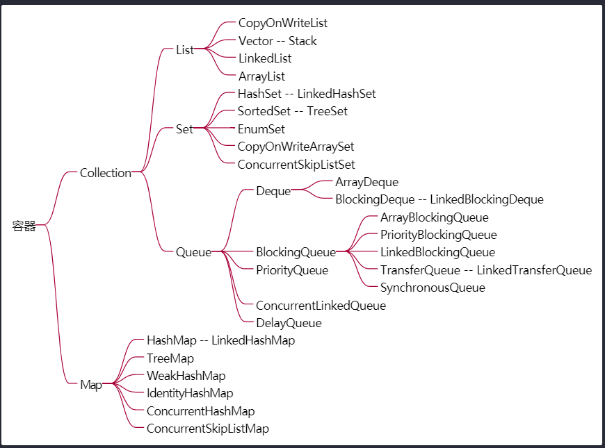

并发/容器
===
      
### 容器
容器牵扯到 : `数据结构 算法 高并发`

物理上存储两种结构
  * 数组 连续存储 
  * 链表 非连续存储

java 两大接口
  * Collection 一个一个
    
    List Set Queue

    Queue 队列最主要的原因是为了实现任务的装载的这种取和装这里面最重要的就是是叫做*阻塞队列*，它的实现的初衷就是为了线程池、高并发做准备的

    Deque 双端队列，一般的队列只是从一端往里扔从另一端往外取。Deque就是说你可以从反方向装从另外一个方向取。
  * Map 一对一对

    HashTable
  
#### Hashtable
* vector 和 Hashtable 自带锁，基本不用(属于早期JDK定义的容器类)
* Hashtable vs `Collections.synchronizedMap(new HashMap<>())` vs ConcurrentHashMap

  1. HashMap 没有锁 线程不安全 不适合多线程读写操作
  1. Hashtable 每个*操作数据的*都加上了`synchronized`关键字 确保线程安全
  1. `Collections.synchronizedMap(new HashMap<>())` 在每个方法内部也都进行了加锁操作
  1. ConcurrentHashMap 使用JUC新锁(CAS)

  性能比较:

  1. Hashtable 和 `Collections.synchronizedMap(new HashMap<>())` 
  
      原理上是类似的 并发写入 比 并发读取 快
  1. ConcurrentHashMap 使用(CAS 有读写锁)    

      并发写入速度一般 并发读取速度很快

  <big>CAS 操作不一定比 Synchronized 性能高 需要看使用场景

  看并发量 锁定时间的长短</big>

  * 单线程 直接HashMap ArrayList LinkedList

  * 高并发 代码执行时间短 ConcurrentHashMap ConcurrentLinkedQueue

  * 并发量少 代码执行时间长 `Collections.synchronizedMap `等

  * 关键就是: 结合实际情况灵活选择
#### Vector List Queue
* Vector 内部的每个*操作数据的*方法也都有加 `synchronized`关键字 
* List ArrayList LinkedList 非线程安全的容器
* 包装 List 成为同步容器 `Collections.synchronizedList(new LinkedList<>())`
* ConcurrentLinkedQueue (CAS) 线程安全

  add 添加
  
  poll 取值
#### ConcurrentMap  
* ConcurrentHashMap 无序
  
  TreeMap 红黑树 排序的 因为cas操作实现太复杂 而没有类似一个`ConcurrentTreeMap`的这样一个类
* ConcurrentSkipListMap 有序

  高并发Map 并且是有序的

  跳表原理: 

  1. 底层结构为链表 链表是有序的 但是有序链表查找和插入操作都比较复杂 
  1. SkipList 根据链表的容量 拿出部分关键元素 组建新的一层简化链表 实际中会划分出多个层级
  1. 当需要做插入和查询操作的时候 可以逐层的的比对 来快速的获取数据在链表中对应的位置
#### CopyOnWrite
写时复制  

适合场景: <big>写的情况比较少 读的情况比较多</big>

读的时候*不加锁* 写时拷贝出一个副本操作 完成后将引用地址指向新的副本

这样的情况下写操作的性能会比较低

有两个实现类 `CopyOnWriteList` `CopyOnWriteSet`

```java
//CopyOnWriteList 写操作 加锁 复制
public boolean add(E e) {
    synchronized (lock) {
        Object[] es = getArray();
        int len = es.length;
        es = Arrays.copyOf(es, len + 1);//复制一个新副本操作
        es[len] = e;
        setArray(es);
        return true;
    }
}
```
#### Queue BlockingQueue
Queue与List的区别
  1. 添加了对线程友好的 API offer peek poll
  1. `BlockingQueue ` put take -> 阻塞 (用于实现 生产消费者模型)
* ConcurrentLinkedQueue

  `implements Queue` 实现Queue

  线程安全的接口
    1. offer 添加 在此队列的尾部插入指定元素。由于队列是无界的，这个方法永远不会返回false 。
    1. poll 取值 并删除 检索并删除此队列的头部，如果此队列为空，则返回null 。
    1. peek 取值 不删除 检索但不删除此队列的头部，如果此队列为空，则返回null 
* LinkedBlockingQueue

  无界队列

  `BlockingQueue<E> extends Queue` 实现自 BlockingQueue

  阻塞的接口:
    1. put 阻塞的 在此队列的尾部插入指定元素
    1. take 阻塞的 检索并删除此队列的头部
* ArrayBlockingQueue

  实现自 BlockingQueue 有界队列 可以设定队列size

  满了就会等待 程序阻塞
  ```java
  BlockingQueue<String> strs = new ArrayBlockingQueue<>(10);
  for (int i = 0; i < 10; i++) {
     strs.put("a" + i);
  }
  
  strs.put("aaa"); //满了就会等待，程序阻塞 在此队列的尾部插入指定元素，如果队列已满，则等待空间可用。
  strs.add("aaa"); //在此队列的尾部插入指定元素，成功时返回true ，如果此队列已满则抛出IllegalStateException 。
  strs.offer("aaa");//在此队列的尾部插入指定元素，成功时返回true ，如果队列已满则返回false 
  strs.offer("aaa", 1, TimeUnit.SECONDS);//在此队列的尾部插入指定元素，如果队列已满，则等待指定的等待时间以使空间可用。
  ```
* PriorityQueue

  基于优先级堆的无界优先级队列 内部实现了二叉树排序

  这个二叉树可以认为是堆排序里面的那个最小堆值排在最上面
  ```java
  PriorityQueue<String> q = new PriorityQueue<>();

  q.add("c");
  q.add("e");
  q.add("a");
  q.add("d");
  q.add("z");
  int size = q.size();
  for (int i = 0; i < size; i++) {
      System.out.println(q.poll());
  }
  //[a c d e z]
  ```
* DelayQueue

  实现自 BlockingQueue 可以实现在时间上的排序 DelayQueue本质上用的是一个PriorityQueue
  ```java
  class DelayObject implements Delayed{
    String data;
    long delayTime;
    long startTime;

    public DelayObject(String data, long startTime) {
        this.data = data;
        this.delayTime = startTime;
        this.startTime = System.currentTimeMillis() + startTime;
    }

    @Override
    public long getDelay(TimeUnit unit) {
        return unit.convert(startTime - System.currentTimeMillis(), unit);
    }

    @Override
    public int compareTo(Delayed o) {
        return (int) (this.getDelay(TimeUnit.MILLISECONDS) - o.getDelay(TimeUnit.MILLISECONDS));
    }
  }

  BlockingQueue<DelayObject> delayQueue = new DelayQueue<>();
  DelayObject t1 = new DelayObject("t1", 3000);
  DelayObject t2 = new DelayObject("t2", 2000);
  DelayObject t3 = new DelayObject("t3", 5000);
  DelayObject t4 = new DelayObject("t4", 1000);
  delayQueue.put(t1);
  delayQueue.put(t2);
  delayQueue.put(t3);
  delayQueue.put(t4);
  for (; delayQueue.size() > 0; ) {
      System.out.println(delayQueue.take());
  }
  ```
  输出
  ```
  DelayObject{data='t4', delayTime=1000}
  DelayObject{data='t2', delayTime=2000}
  DelayObject{data='t1', delayTime=3000}
  DelayObject{data='t3', delayTime=5000}
  ```
* SynchronousQueue

  实现自 BlockingQueue 容量为0 专门用于线程之间的内容传递 类似 Exchanger(它可以双向传递)的功能

  通常调用 take put 阻塞
  
  调用 add可能会报错 `IllegalStateException("Queue full")` 需要提前有线程 take才能成功调用
  ```java
  BlockingQueue<String> queue = new SynchronousQueue<>();
  new Thread(()->{
      System.out.println(queue.take());
    }
  ).start();
  queue.put("aaa");//阻塞等待消费者take
  //Thread.sleep(10);
  //queue.add("aaa");//需要确保 有消费线程已经在take add才不会抛出异常
  ```  
* TransferQueue

  实现自 BlockingQueue 各种Queue的一个组合

  关键API:
  1. transfer 将元素传输给消费者，并在必要时等待

  1. tryTransfer 等待将元素传输给等待的消费者 直到超时否则返回false

  在调用`transfer`后会一直阻塞等待 直到有消费线程调用 `take`
  ```java
  LinkedTransferQueue<String> transferQueue = new LinkedTransferQueue<>();    
  new Thread(()->{
    try {
      System.out.println("阻塞等待消费线程调用 take");
      transferQueue.transfer("test transfer msg");
      System.out.println("消费线程调用 take 成功");
    } catch (InterruptedException e) {
      e.printStackTrace();
    }
  }).start();

  try {
    Thread.sleep(1000);
    System.out.println("消费线程take:"+transferQueue.take());
  } catch (InterruptedException e) {
    e.printStackTrace();
  }   
  ```