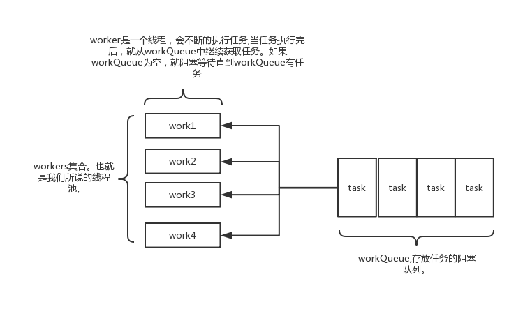

线程池基础知识
===
## ThreadPool常用接口/类
### Executor接口相关内容

  
* ExecutoService
  ```java
  void shutdown();//结束 其中已经提交的任务会等到执行结束
  List<Runnable> shutdownNow();//马上结束
  boolean isShutdown();//是否结束了
  boolean isTerminated();//是不是整体都执行完了
  boolean awaitTermination(long timeout, TimeUnit unit) //等着结束,等多长时间,时间到了还不结束的话他就返回false
  ```
* Callable / Future 的作用 
  ```java
  public interface Callable<V> {
    V call() throws Exception;
  }
  ```
  1. `Callable` 类似Runnable 但是有返回值
  1. `Future` 用于存储将来执行的结果
  1. `Future.get()` 阻塞的获取返回值

  `Callable 配置 Future` 使用方式
  ```java
  Callable<String> c = new Callable() {
      @Override
      public String call() throws Exception {
          return "Hello Callable";//返回异步计算结果
      }
  };
  ExecutorService service = Executors.newCachedThreadPool();
  Future<String> future = service.submit(c); //提交异步任务
  System.out.println(future.get());//阻塞获取返回值
  service.shutdown();//停止线程池
  ```
* FutureTask  

  `FutureTask` 即是一个Future同时又是一个Task, 既可以执行又可以存结果. 原来这Callable只能一个Task只能是一个任务但是他不能作为一个Future来用

  `FutureTask<V> implements RunnableFuture<V> extends Runnable, Future<V>`

  `WorkStealingPool ,ForkJoinPool` 这些个基本上是会用到FutureTask类

  ```java
  FutureTask<Integer> task = new FutureTask<>(()->{
		TimeUnit.MILLISECONDS.sleep(500);
		return 1000;
	}); 
	
	new Thread(task).start();//执行FutureTask
	
	System.out.println(task.get()); //阻塞 获取FutureTask结果
  ```
### CompletableFuture

  通常用于组合各种不同的任务的异步执行

  参考:[20个使用 Java CompletableFuture的例子](https://colobu.com/2018/03/12/20-Examples-of-Using-Java%E2%80%99s-CompletableFuture/)

  异步任务默认 在`ForkJoinPool.commonPool()`中运行的任务异步完成

  * 等待多个异步任务输出结果
    ```java
    CompletableFuture<Double> futureTM = CompletableFuture.supplyAsync(() -> priceOfTM());//查询 TM价格
    CompletableFuture<Double> futureTB = CompletableFuture.supplyAsync(() -> priceOfTB());//查询 TB价格
    CompletableFuture<Double> futureJD = CompletableFuture.supplyAsync(() -> priceOfJD());//查询 JD价格

    CompletableFuture.allOf(futureTM, futureTB, futureJD).join();//等待全部查询结果输出
    ```
  * 流式API调用
    ```java
    CompletableFuture.supplyAsync(() -> priceOfTM())
                .thenApply(String::valueOf)
                .thenApply(str -> "price " + str)
                .thenAccept(System.out::println);
    ```  
  * 使用定制的Executor
    ```java
    static ExecutorService executor = Executors.newFixedThreadPool(3, new ThreadFactory() {
        int count = 1;    
        @Override
        public Thread newThread(Runnable runnable) {
            return new Thread(runnable, "custom-executor-" + count++);
        }
    });

    CompletableFuture.supplyAsync(() -> priceOfTM(), executor);
    ```
  * 汇总结果的例子
    ```java
    List<CompletableFuture<Integer>> futureList = Lists.newArrayList();
    for (int i = 0; i < 20; i++) {
        int finalI = i;
        // ForkJoinPool.commonPool()异步线程池执行任务
        CompletableFuture<Integer> future = CompletableFuture.supplyAsync(() -> {
            HelperUtil.SleepHelper.sleep(20);
            int result = RandomUtil.randomInt(10);
            return 1;
        });
        futureList.add(future);
    }
    CompletableFuture<Void> allOf =
            CompletableFuture.allOf(futureList.toArray(new CompletableFuture[futureList.size()]))
                    .whenComplete((v, th) -> {
                        //统计计算结果
                        int sum = futureList.stream().mapToInt(cf -> cf.getNow(null)).sum();
                        System.out.println("done sum:" + sum);
                    });
    //等待全部计算完成 同步等待计算结果
    allOf.join();
    ```
### ThreadPoolExecutor 细节



线程池结构: 一个线程集合workerSet和一个阻塞队列workQueue

线程池会先将任务放入workQueue中。workerSet中的线程会不断的从workQueue中获取线程然后执行。

当workQueue中没有任务的时候,worker就会阻塞,直到队列中有任务了就取出来继续执行
* 构造函数的七个参数解析
  ```java
                            
  public ThreadPoolExecutor(int corePoolSize, //线程池中的核心线程数 (长工数量)
                            
                            int maximumPoolSize, //线程池允许的最大线程数 (max-core=临时工数量)
                            
                            long keepAliveTime, //线程空闲存活时间
                            
                            TimeUnit unit, //keepAliveTime单位
                            
                            BlockingQueue<Runnable> workQueue, //工作任务的阻塞队列
                            
                            ThreadFactory threadFactory, //创建线程的工厂
                            
                            RejectedExecutionHandler handler) //线程池拒绝策略(饱和策略)
  ```
  * workQueue 任务队列 
  
    各种各样的BlockingQueue
    * `ArrayBlockingQueue`: 基于数组结构的有界阻塞队列,按FIFO排序任务 
    * `LinkedBlockingQuene`: 基于链表结构的阻塞队列,按FIFO排序任务,吞吐量通常要高于ArrayBlockingQuene 
    * `SynchronousQuene`: 一个不存储元素的阻塞队列,每个插入操作必须等到另一个线程调用移除操作,否则插入操作一直处于阻塞状态,吞吐量通常要高于LinkedBlockingQuene 
    * `PriorityBlockingQuene`: 具有优先级的无界阻塞队列

    `LinkedBlockingQueue`比`ArrayBlockingQueue`在插入删除节点性能方面更优,但是二者在`put(), take()`任务的时均需要加锁,
  
    `SynchronousQueue`使用无锁算法,根据节点的状态判断执行,而不需要用到锁,其核心是`Transfer.transfer()`
  * 线程工厂 默认 `DefaultThreadFactory`  
    ```java
    DefaultThreadFactory() {
        SecurityManager s = System.getSecurityManager();
        group = (s != null) ? s.getThreadGroup() :
                              Thread.currentThread().getThreadGroup();
        namePrefix = "pool-" +
                      poolNumber.getAndIncrement() +
                     "-thread-";
    }

    public Thread newThread(Runnable r) {
        Thread t = new Thread(group, r,
                              namePrefix + threadNumber.getAndIncrement(),
                              0);//设置线程名称等信息
        if (t.isDaemon())
            t.setDaemon(false);//设置为非守护线程
        if (t.getPriority() != Thread.NORM_PRIORITY)
            t.setPriority(Thread.NORM_PRIORITY);//设置线程优先级别
        return t;
    }
    ```

    定义好线程工厂 方便在错误日志中排查问题
  
  * `RejectedExecutionHandler` 默认四种拒绝策略

    1. AbortPolicy: 直接抛出异常,默认策略;
      
        ```java
        public static class AbortPolicy implements RejectedExecutionHandler {
          public void rejectedExecution(Runnable r, ThreadPoolExecutor e) {
              throw new RejectedExecutionException("Task " + r.toString() +
                                                  " rejected from " +
                                                  e.toString());
          }
        }
        ```
    1. CallerRunsPolicy: 用调用者所在的线程来执行任务, 即主线程;

        ```java
        public static class CallerRunsPolicy implements RejectedExecutionHandler {
          public void rejectedExecution(Runnable r, ThreadPoolExecutor e) {
            if (!e.isShutdown()) {
                r.run();
            }
          }
        }
        ```

    1. DiscardOldestPolicy: 丢弃阻塞队列中靠最前的任务,并执行当前任务;

        ```java
        public static class DiscardOldestPolicy implements RejectedExecutionHandler {
          public void rejectedExecution(Runnable r, ThreadPoolExecutor e) {
            if (!e.isShutdown()) {
                e.getQueue().poll();//直接丢弃最前面的任务
                e.execute(r);
            }
          }
        }
        ```
    1. DiscardPolicy: 直接丢弃任务 什么都不做 通常不要这样处理;

        ```java
        public static class DiscardPolicy implements RejectedExecutionHandler {
          public void rejectedExecution(Runnable r, ThreadPoolExecutor e) {
          }
        }  
        ```
    1. 自定义拒绝策略
        ```java
        static class MyRejectedHandler implements RejectedExecutionHandler {
          @Override
          public void rejectedExecution(Runnable r, ThreadPoolExecutor executor) {
                  //log("r rejected") 记录日志
                  //save r kafka mysql redis 保存任务数据
                  //try 3 times 重试
                  //if (executor.getQueue().size() < 10000) {
                      //try put again();
                  //}
              }
        }
        ```    
* Executors 提供封装好的线程池

  使用线程池的意义:
    1. 有任务队列
    1. 生命周期管理

  常见封装好的线程池:  
    1. SingleThreadExecutor 单个线程的线程池      
        ```java
        public static ExecutorService newSingleThreadExecutor() {
            return new FinalizableDelegatedExecutorService
                (new ThreadPoolExecutor(1, 1,
                                        0L, TimeUnit.MILLISECONDS,
                                        new LinkedBlockingQueue<Runnable>()));//LinkedBlockingQueue 默认容量 Integer.MAX_VALUE
        }
        ```
    1. CachedThreadPool 来一个任务 启动一个线程 
        
        任务队列为0(`SynchronousQueue`) 因为会创建大量线程(有多少任务就创建多少线程), 

        ~~理想使用场景: 任务量忽高忽低 但又必须全都执行 ; 不建议使用!~~
        ```java
        public static ExecutorService newCachedThreadPool() {
          return new ThreadPoolExecutor(0, Integer.MAX_VALUE,//线程池最大为 Integer.MAX_VALUE
                                      60L, TimeUnit.SECONDS,//线程存货时间
                                      new SynchronousQueue<Runnable>());//SynchronousQueue size=0
        }
        ```
    1. FixedThreadPool 固定线程数量

        ~~使用场景: 任务量比较固定 不建议使用!~~
        ```java
        public static ExecutorService newFixedThreadPool(int nThreads) {
        return new ThreadPoolExecutor(nThreads, nThreads,//核心线程数量和最大线程数量一致
                                      0L, TimeUnit.MILLISECONDS,
                                      new LinkedBlockingQueue<Runnable>());//任务上限还是 Integer.MAX_VALUE
        }
        ```   
    1. ScheduledThreadPool 定时任务线程池 

        相关的定时任务框架 `quartz` `cron`

        ```java
        Runnable beeper = () -> System.out.println("beep");
        ScheduledFuture<?> beeperHandle = scheduler.scheduleAtFixedRate(beeper, 10, 10, SECONDS);//间隔10秒执行一次输出
        Runnable canceller = () -> beeperHandle.cancel(false);//false 允许完成正在进行的任务,true 打断正在执行的任务
        scheduler.schedule(canceller, 1, HOURS);//一小时后取消任务
        ```

* 阿里开发规范对JDK默认线程池的弊端分析

  说明: Executors 返回的线程池对象 的弊端 如下
  1. FixedThreadPool 和 SingleThread Pool
  
    允许的请求队列长度为 Integer.MAX_VALUE,可 能会堆积大量的请求,从而导致 OOM。
  1. CachedThreadPool 和 ScheduledThreadPool
  
    允许的创建线程数量为 Integer.MAX_VALUE 可能会创建大量的线程,从而导致 OOM
* concurrent vs parallel (并发与并行)

  并发是值任务提交 , 很多任务同时被提交过来

  并行指任务执行 , 多个任务在多个CPU上运行