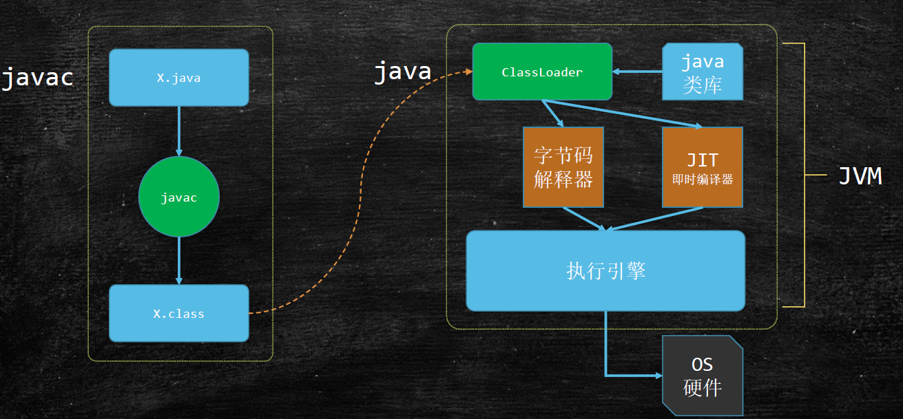
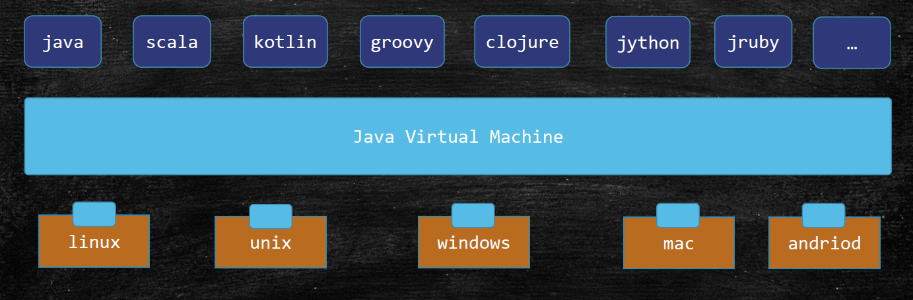
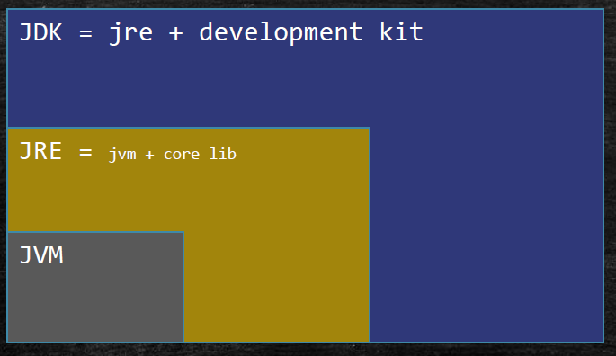

JVM基础
===
## Java从编码到执行
  
## JVM 从跨平台的语言到跨语言的平台

JVM现在支持上百种语言在其规范下运行
  
## JVM官方文档
[Java 平台，标准版文档](https://docs.oracle.com/en/java/javase/)
## 常见的JVM实现
* Hotspot

  oracle 官方
* IBM 实现 J9   
* Microsoft VM
* Taobao VM

  hotspot深度定制
* LiquidVM

  直接针对硬件
* azul zing

  最新垃圾回收的业界标杆 hotspot G1也有借鉴

  http://www.azul.com
## 关于java收费

  Hotspot 8 以后需要收费
  1. openjdk
  1. Taobao VM
## JVM JRE JDK  之间的关系
