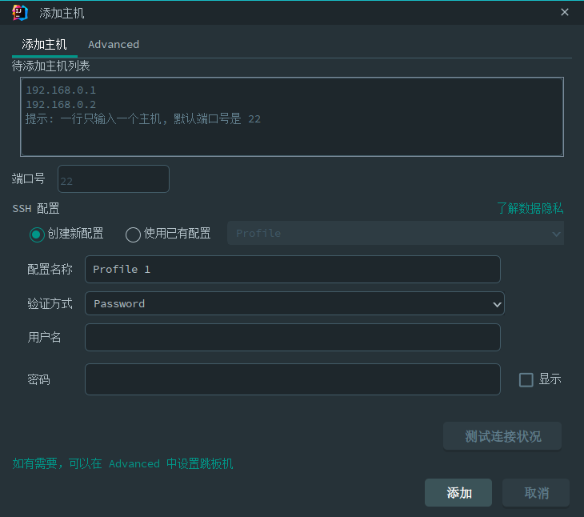

Arthas调优工具
---
* [官方文档](https://arthas.aliyun.com/doc/)
* [安装](https://arthas.aliyun.com/doc/install-detail.html)
  ```shell
  curl -L https://arthas.aliyun.com/install.sh | sh
  # 上述命令会下载启动脚本文件 as.sh 到当前目录，你可以放在任何地方或将其加入到 $PATH 中。
  # 直接在shell下面执行./as.sh，就会进入交互界面。
  # 也可以执行./as.sh -h来获取更多参数信息。
  ```
* [命令列表](https://arthas.aliyun.com/doc/commands.html)
* [通过Cloud Toolkit插件使用Arthas一键诊断远程服务器](https://github.com/alibaba/arthas/issues/570)
  1. 添加远程服务信息
    
      
  1. 选择 `诊断` 启动并进入 Arthas工具 , 其实就是整合了ssh 控制台到`idea`中, 比较方便点而已
* [Arthas在线教程(katacoda)](https://arthas.aliyun.com/doc/arthas-tutorials.html?language=cn)
> 缺少类似 `jmap -histo pid ` 命令的功能
## 命令列表
### dashboard
包含: Thread , Memory, GC, Runtime等信息
[当前系统的实时数据面板，按 ctrl+c 退出。](https://arthas.aliyun.com/doc/dashboard.html)
### jvm
[查看当前JVM信息](https://arthas.aliyun.com/doc/jvm.html)
```shell
RUNTIME # jvm运行时参数
GARBAGE-COLLECTORS # 回收器类型
MEMORY-MANAGERS # 内存管理器
MEMORY # 内存占用
OPERATING-SYSTEM # 系统信息
THREAD # 线程信息
```
### thread
[查看当前线程信息，查看线程的堆栈](https://arthas.aliyun.com/doc/thread.html)

```
thread -i 1000 : 统计最近1000ms内的线程CPU时间。
thread -n 3 -i 1000 : 列出1000ms内最忙的3个线程栈
```
### sc
[查看JVM已加载的类信息](https://arthas.aliyun.com/doc/sc.html)
```shell
sc demo.*  # 搜索打印指定包下的类名
sc -d FullGC_Problem01$CardInfo #打印类的详细信息
sc -d -f FullGC_Problem01$CardInfo #打印出类的Field信息
```
### jad
[反编译指定已加载类的源码](https://arthas.aliyun.com/doc/jad.html)
```shell
jad demo.MathGame # 反编译输出指定类
jad --source-only demo.MathGame #反编译时只显示源代码
jad demo.MathGame main #反编译指定的函数
jad demo.MathGame main --lineNumber false #--lineNumber 参数默认值为true，显示指定为false则不打印行号。

jad --source-only --lineNumber false demo.MathGame > /tmp/MathGame.java #jad反编译的结果保存在 /tmp/MathGame.java文件里了。
```
### heapdump
[dump java heap, 类似jmap命令的heap dump功能。](https://arthas.aliyun.com/doc/heapdump.html)

这里需要注意的是 `heapdump` 类似`jmap dump` 操作, 会造成卡顿 不建议在生产环境直接使用
### mc
[Memory Compiler/内存编译器，编译.java文件生成.class。](https://arthas.aliyun.com/doc/mc.html)

依赖线上环境编译修改的class文件
### redefine 热更新class文件
[热加载更新: 加载外部的.class文件，redefine jvm已加载的类。](https://arthas.aliyun.com/doc/redefine.html)
1. sc 搜索要替换的class
    ```shell
    sc *UserController -d
    ```
1. jad命令反编译并导出，然后可以用其它编译器，比如vim来修改源码
    ```
    jad com.example.demo.arthas.user.UserController --source-only --lineNumber false > /tmp/UserController.java 
    ```

1. mc命令来内存编译修改过的代码
    ```shell
    mc --classLoaderClass org.springframework.boot.loader.LaunchedURLClassLoader /tmp/UserController.java -d /tmp 

    mc -c 1be6f5c3 /tmp/UserController.java -d /tmp 
    ```
    * `--classLoaderClass`参数指定ClassLoader ; `-d`命令指定输出目录
    * `-c` 参数指定classloaderHash: `1be6f5c3`; `sc *UserController -d`指令可以查看 `classLoaderHash`
1. 用redefine命令加载新的字节码
    ```shell
    redefine /tmp/com/example/demo/arthas/user/UserController.class
    ```
1. [redefine 限制](https://arthas.aliyun.com/doc/redefine.html#id4)
    * 不允许新增加field/method, 不能改方法名, 不能改属性
    * 正在跑的函数，没有退出不能生效，比如下面新增加的System.out.println，只有run()函数里的会生效
      ```java
      public class MathGame {
        public static void main(String[] args) throws InterruptedException {
            MathGame game = new MathGame();
            while (true) {
                game.run();
                TimeUnit.SECONDS.sleep(1);
                // 这个不生效，因为代码一直跑在 while里
                System.out.println("in loop");
            }
        }  
        public void run() throws InterruptedException {
            // 这个生效，因为run()函数每次都可以完整结束
            System.out.println("call run()");
            try {
                int number = random.nextInt();
                List<Integer> primeFactors = primeFactors(number);
                print(number, primeFactors);
    
            } catch (Exception e) {
                System.out.println(String.format("illegalArgumentCount:%3d, ", illegalArgumentCount) + e.getMessage());
            }
        }
      }
      ```
## useful scripts - 有用的脚本
[useful scripts - 有用的脚本](https://github.com/oldratlee/useful-scripts)
### show-busy-java-threads
用于快速排查Java的CPU性能问题(top us值过高)，自动查出运行的Java进程中消耗CPU多的线程，并打印出其线程栈，从而确定导致性能问题的方法调用。

```
show-busy-java-threads -p <指定的Java进程Id>
show-busy-java-threads 3 10 pid # 每3秒更新一次，更新10次
```

[show-busy-java-threads 用法](https://github.com/oldratlee/useful-scripts/blob/dev-2.x/docs/java.md#-show-busy-java-threads)
### show-duplicate-java-classes
[找出jar文件和class目录中的重复类。用于排查Java类冲突问题。](https://github.com/oldratlee/useful-scripts/blob/dev-2.x/docs/java.md#-show-duplicate-java-classes)
### find-in-jars
在目录下所有jar文件里，查找类或资源文件。
