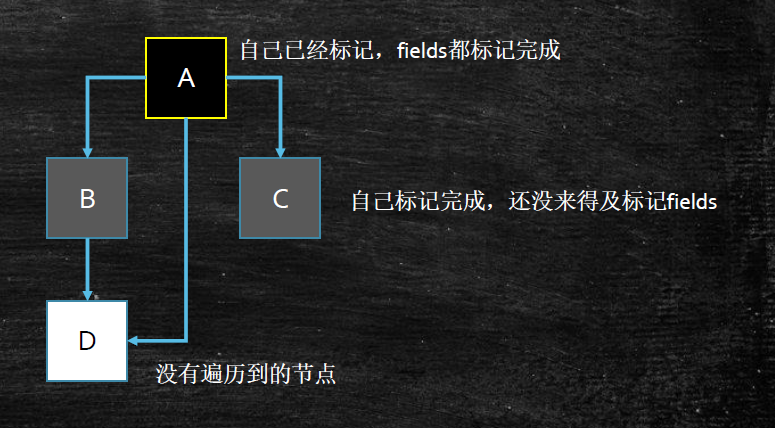
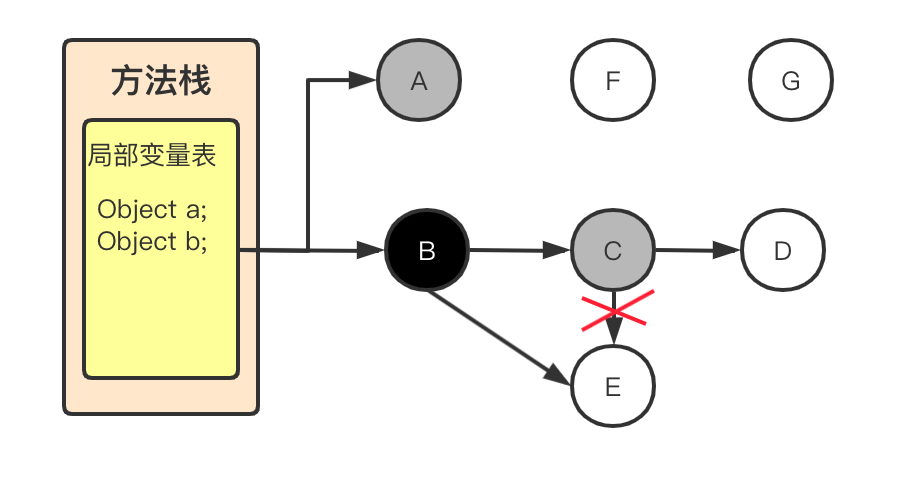

G1 - 垃圾收集器
---
参考:[Java Hotspot G1 GC的一些关键技术](https://tech.meituan.com/2016/09/23/g1.html)
## 垃圾收集器发展过程
* Serial 串行收集器
* Parallel 并行收集器 _1.8默认收集器_
* CMS 并发收集器(老年代)
  
  |阶段||JVM状态|工作内容|
  |-|-|-|-|
  |initial mark | 初始标记|STW|CG roots 标记|
  |concurrent mark | 并发标记||三色标记(与工作线程并发运行,耗时最长的过程)|
  |remark | 重标记|STW|增量更新 (处理漏标)|
  |concurrent sweep | 并发清除||(与工作线程并发运行,可能产生浮动垃圾)|
* 1.4版本后期引入 CMS
* 1.5 - 1.6 开始流行
* 1.7 引入G1 
  > 作为体验版随着JDK 6u14版本面世,在JDK 7u4版本发行时被正式推出
* 1.8 如果内存比较大推荐使用G1
* 11 默认使用G1收集器
## G1
G1 GC (Garbage First Garbage Collector) - 垃圾优先收集器

> 是用于 Java HotSpot VM的低暂停、服务器式的分代垃圾收集器.G1 GC 使用并发和并行阶段来实现其目标暂停时间并保持良好的吞吐量.当 G1 GC 确定需要进行垃圾收集时,它会首先收集具有最少活动数据(垃圾最多)的区域（垃圾优先）.
>
> G1收集器的设计目标是取代CMS收集器,它同CMS相比,在以下方面表现的更出色:  
  * G1是一个有整理内存过程的垃圾收集器,不会产生很多内存碎片. 
  * G1的Stop The World(STW)更可控,G1在停顿时间上添加了预测机制,用户可以指定期望停顿时间.

* G1 适用的场景:
  * 像CMS收集器一样,能与应用程序线程并发执行. 
  * 整理空闲空间更快. 
  * 需要GC停顿时间更好预测. 
  * 不希望牺牲大量的吞吐性能. 
  * 不需要更大的Java Heap.

* [G1垃圾收集器调优](https://www.oracle.com/technical-resources/articles/java/g1gc.html)
### G1 Region - 区域
* Region 内存区域分块, 逻辑分代, 物理不分代

  传统的GC收集器将连续的内存空间划分为新生代、老年代和永久代（JDK 8去除了永久代,引入了元空间Metaspace）,这种划分的特点是各代的存储地址（逻辑地址,下同）是连续的

  <image src="./img/Tradition_GC_MM.png" width="50%"/>

  G1的各代存储地址是不连续的,每一代都使用了n个不连续的大小相同的Region,每个Region占有一块连续的虚拟内存地址
  
  <image src="./img/G1_region.png" width="50%"/>

  Region 逻辑中的分代:
  1. Eden
  1. Survivor
  1. Old
  1. Humongous (巨大对象分区)
* 一个Region的大小可以通过参数`-XX:G1HeapRegionSize`设定,取值范围从1M到32M,该值将是 2 的幂.如果不设定,那么G1会根据Heap大小自动决定
* MIN_REGION_SIZE(1MB) 和MAX_REGION_SIZE(32MB) 是硬限制
* TARGET_REGION_NUMBER 默认为2048; 如果 RegionSize = 32m 默认堆大小为64G? 

  当然 RegionNumber 是可以增加的
> G1的内存区域不是固定的 **分代** ,在GC后可能会变成另一种分代(Eden ,Survivor,Old 或者 Humongous)
### G1 特点
* 并发收集, 并发标记 并发收集
* 压缩空间不会延长GC的暂停时间 因为有Region分区
* 更易预测的GC暂停时间 对局部Region做GC更加好控制
* 适用不需要实现很高的吞吐量, 但是很注重 _响应时间_(停顿时间) 的应用常见
## 基本概念
### Card Table
Card Table 是一种points-out（*我引用了谁的对象*）的结构, JVM把内存对象划分到不同的Card中, 每个Card 覆盖一定范围的Heap（一般为512Bytes）

由于做YGC的时候, Old区的对象可能引用了Y区的对象(跨代引用), 这时需要扫描整个Old区, 效率非常底

所以JVM设计了`CardTable`(记录Card的表), 如果一个Old区`CardTable`(位图结构)中有个对象指向Y区

就将它设置为 `Dirty`(脏数据), 下次扫描时, 只需要扫描 `Dirty Card`即可(缩小了需要扫描的范围)

在结构上, `Card Table`用BitMap(位图)来实现
### CSet 
CSet 全称Collection Set, 是辅助GC过程的一种结构, 它记录了GC要收集的Region集合,集合里的Region可以是任意年代的

一组可被回收的Region(分区)的集合 
    
    在CSet标记的分区中存活数据会在GC过程中被移动到另一个可用分区(复制算法)
    CSet中的分区可以来自Eden,Survivor,或者Old空间
    CSet占用不到对空间的1%大小
### RSet 
<image src="./img/G1_RememberedSet.png">

RSet全称是Remembered Set,是辅助GC过程的一种结构,典型的空间换时间工具,属于points-into结构（*谁引用了我的对象*）,和Card Table有些类似.

RSet其实是一个Hash Table,Key是别的Region的起始地址,Value是一个集合,里面的元素是Card Table的Index

<image src="./img/G1_RSet_1.jpg">

RSet 记录了其它`Region`中的对象指向到本`Region`的引用

RSet的价值在于垃圾收集器不需要扫描整个堆找到谁引用了当前分区中的对象

在GC的时候,对于old->young和old->old的跨代对象引用,只要扫描对应的CSet中的RSet即可, 有效减少了GC的工作量

## G1 特点
### 新老年代比例
5% - 60%

一般不用手动设置, 因为这是G1预测停顿时间的基准(G1自适应调整年轻代的大小)

### 三色标记
* 白色: 对象没有被标记到, 标记阶段结束后, 会被当做垃圾回收掉
* 灰色: 对象被标记了, 但是它的field(成员变量)还没有被标记或标记完
* 黑色: 对象被标记了, 并且它的field(成员变量)也被标记完了

  

### SATB
全称是Snapshot-At-The-Beginning, GC开始时活着的对象的快照

它是通过Root Tracing(根追溯)得到的，作用是维持并发GC的正确性。

> Mutator方法用于设置私有字段的值,通常指 set 操作方法
* 漏标(白对象)

  在并发标记时, 引用可能产生变化, 白色对象有可能被错误回收或者漏标  
  * Mutator 赋予一个黑色对象引用该白色对象(B -> E)
  * Mutator 删除了所有灰色对象到该白色对象的直接或者间接引用(C -X> E)

    
* TAMS 指针

  top-at-mark-start（TAMS）指针(头部起始标记)，分别为prevTAMS和nextTAMS。在TAMS以上的对象是新分配的，这是一种隐式的标记。
* 漏标解决方案
  * SATB (G1采用)

    在起始时候做一个快照, 当(C -X> E)灰色指向白色的引用消失时, 要把这个引用(E)推到GC的堆栈, 保证白色对象(E)还能被GC扫描到

    一个对象的引用被替换时，可以通过write barrier(写屏障,这里并非操作系统的写屏障) 将旧引用记录下来。
  * Incremental Update (CMS采用)

    当一个白色对象被黑色对象引用时(B -> E), 将黑色对象(B)重新标记位灰色, 让 Collector重新扫描

### Pause Prediction Model 即停顿预测模型
G1 GC是一个响应时间优先的GC算法,它与CMS最大的不同是,用户可以设定整个GC过程的期望停顿时间,参数`-XX:MaxGCPauseMillis`指定一个G1收集过程目标停顿时间,*默认值200ms,不过它不是硬性条件,只是期望值.*
### GC何时触发
G1 依然会触发FullGC, 而且 *JDK10 以前G1 FullGC是 Serial (串行执行)*, JDK11是并行
* YGC
  * Eden空间不足
  * 多线程并行执行
* FGC
  * Old空间不足
  * System.gc()  
### Mixed GC (混合GC)
Mixed GC相当于CMS

`-XX:InitiatingHeapOccupancyPercent` 当整个堆内存达到一定比例时开始 MixedGC; 默认值 45%

> G1提供了两种GC模式,Young GC和Mixed GC,两种都是完全Stop The World的. 
  * Young GC: 选定所有年轻代里的Region.通过控制年轻代的region个数,即年轻代内存大小,来控制young GC的时间开销. 
  * Mixed GC: 选定所有年轻代里的Region,外加根据`global concurrent marking`(全局并发标记)统计得出收集收益高的 *若干老年代Region*.在用户指定的开销目标范围内尽可能选择收益高的老年代Region.

    `Mixed GC(混合GC) = Young GC + 统计得出GC效率较高的若干个Old Region`
>
> 由上面的描述可知,Mixed GC不是full GC,它只能回收部分老年代的Region,如果mixed GC实在无法跟上程序分配内存的速度,导致老年代填满无法继续进行Mixed GC,就会使用serial old GC（full GC 串行）来收集整个GC heap.
* `global concurrent marking` 它的执行过程类似CMS, 执行过程分为四个步骤: 
  * 初始标记（initial mark,STW）.它标记了从GC Root开始直接可达的对象. 
  * 并发标记（Concurrent Marking）.这个阶段从GC Root开始对heap中的对象标记,标记线程与应用程序线程并行执行,并且收集各个Region的存活对象信息. 
  * 最终标记（Remark,STW）.标记那些在并发标记阶段发生变化的对象,将被回收. 
  * 清除垃圾（Cleanup）.清除空Region（没有存活对象的）,加入到free list.

  > 第一阶段`initial mark`是共用了Young GC的暂停，这是因为他们可以复用root scan操作，所以可以说`global concurrent marking`是伴随Young GC而发生的。
  
  > 第四阶段Cleanup只是回收了没有存活对象的Region，所以它并不需要STW。
* 相关参数
  * `-XX:G1HeapWastePercent`: 在`global concurrent marking`结束之后,我们可以知道`old gen regions`中有多少空间要被回收,在每次`YGC`之后和再次发生`Mixed GC`之前,会检查垃圾占比是否达到此参数,*只有达到了,下次才会发生Mixed GC*. 默认:5 (JDK11)
  * `-XX:G1MixedGCLiveThresholdPercent`: 为混合垃圾收集周期中包含的旧区域设置占用阈值, 默认:65%; 用于替换 `-XX:G1OldCSetRegionLiveThresholdPercent `设置
  * `-XX:G1MixedGCCountTarget`: 一次global concurrent marking之后,最多执行Mixed GC的次数. 默认:8 (JDK11)
  * `-XX:G1OldCSetRegionThresholdPercent`: 一次Mixed GC中能被选入CSet的最多old generation region数量.默认:10%
### G1主要参数
|参数|含义|
|-|:-|
|-XX:G1HeapRegionSize=n|设置Region大小，并非最终值,取值范围从1M到32M,该值将是 2 的幂|
|-XX:MaxGCPauseMillis|设置G1收集过程目标时间，默认值200ms，不是硬性条件|
|-XX:G1NewSizePercent|新生代最小值，默认值5%|
|-XX:G1MaxNewSizePercent|新生代最大值，默认值60%|
|-XX:ParallelGCThreads|STW期间，并行GC线程数|
|-XX:ConcGCThreads=n|并发标记阶段，并行执行的线程数|
|-XX:InitiatingHeapOccupancyPercent|设置触发标记周期的 Java 堆占用率阈值。默认值是45%。这里的java堆占比指的是non_young_capacity_bytes(非年轻代)，包括old+humongous(老年代+巨大对象)|
