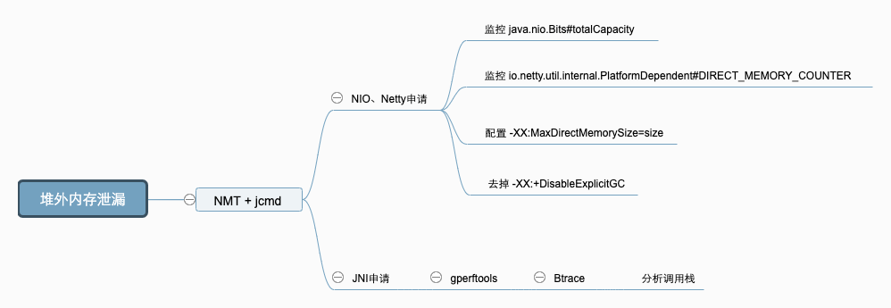

CMS调优案例
---
参考: [Java中9种常见的CMS GC问题分析与解决 - 美团技术博客](https://tech.meituan.com/2020/11/12/java-9-cms-gc.html)
### 场景一:动态扩容引起的空间震荡
* 现象
  
  服务刚刚启动时 GC 次数较多,最大空间剩余很多但是依然发生 GC,这种情况我们可以通过观察 GC 日志或者通过监控工具来观察堆的空间变化情况即可.GC Cause 一般为 `Allocation Failure`,且在 GC 日志中会观察到经历一次 GC ,堆内各个空间的大小会被调整,
* 原因

  在 JVM 的参数中 -Xms 和 -Xmx 设置的不一致,在初始化时只会初始 -Xms 大小的空间存储信息,每当空间不够用时再向操作系统申请,这样的话必然要进行一次 GC.
* 策略
  * 定位:观察 CMS GC 触发时间点 Old/MetaSpace 区的 committed 占比是不是一个固定的值,或者像上文提到的观察总的内存使用率也可以.
  * 解决:尽量将成对出现的空间大小配置参数设置成固定的,如 `-Xms` 和 `-Xmx`,`-XX:MaxNewSize` 和 `-XX:NewSize`,`-XX:MetaSpaceSize` 和 `-XX:MaxMetaSpaceSize` 等
### 场景二: System.gc 显示调用GC的去留
* 现象
  
  在代码中手动调用System.gc, 会引起Full GC, 可以通过参数 `-XX:+DisableExplicitGC` 禁用
  1. 保留 System.gc 


      **CMS GC 共分为 Background(后台) 和 Foreground(前台) 两种模式**

      1. `Background`就是我们常规理解中的并发收集,可以不影响正常的业务线程运行
      1. 但 `Foreground Collector` 却有很大的差异,他会进行一次压缩式 GC. 此压缩式 GC 使用的是跟 Serial Old GC(串行) 一样的 Lisp2 算法,其使用 Mark-Compact 来做 Full GC,一般称之为 MSC（Mark-Sweep-Compact）,*它收集的范围是 Java 堆的 Young 区和 Old 区以及 MetaSpace.*
      1. 使用 `Foreground Collector` 时将会带来非常长的 STW. <big>如果在应用程序中 `System.gc` 被频繁调用,那就非常危险了.</big>
  1. 去掉 System.gc

      DirectByteBuffer(直接内存) 分配空间过程中会显式调用 `System.gc` ,希望通过 Full GC 来强迫已经无用的 DirectByteBuffer 对象释放掉它们关联的 Native Memory

      CMS GC 的话会对 Old 做 Reference Processing,进而能触发 Cleaner 对已死的 DirectByteBuffer 对象做清理工作.

      但如果很长一段时间里没做过 GC 或者只做了 Young GC 的话则不会在 Old 触发 Cleaner 的工作,那么就可能让本来已经死亡,但已经晋升到 Old 的 DirectByteBuffer 关联的 Native Memory 得不到及时释放.

      如果打开了 `-XX:+DisableExplicitGC`,清理工作就可能得不到及时完成,于是就有发生 Direct Memory 的 OOM.
* 策略

  JVM 还提供了 `-XX:+ExplicitGCInvokesConcurrent` 和 `-XX:+ExplicitGCInvokesConcurrentAndUnloadsClasses` 参数来将 System.gc 的触发类型从 Foreground 改为 Background,同时 Background 也会做 Reference Processing,这样的话就能大幅降低了 STW 开销,同时也不会发生 NIO Direct Memory OOM

  上面的两个参数只能与 `-XX:+UseConcMarkSweepGC` 选项一起启用.也就是开启CMS后才能使用

  不止 CMS,在 G1 或 ZGC中开启 `-XX:+ExplicitGCInvokesConcurrent` 模式, 都会采用高性能的并发收集方式进行收集,
  
  > 不过还是建议在代码规范方面也要做好约束,规范好 System.gc 的使用.

  HotSpot 里的许多 GC 算法都带有自适应的功能,会根据先前收集的效率来决定接下来的 GC 中使用的参数,但 System.gc 默认不更新这些统计数据,避免用户强行 GC 对这些自适应功能的干扰（可以参考 -XX:+UseAdaptiveSizePolicyWithSystemGC 参数,默认是 false）.
### 场景三: MetaSpace 区 OOM
* 现象:

  MetaSpace 的已使用大小在持续增长,同时每次 GC 也无法释放,调大 MetaSpace 空间也无法彻底解决.
* 原因:

  MetaSpace 主要由 Klass Metaspace 和 NoKlass Metaspace 两大部分组成
  1. Klass MetaSpace: 就是用来存 Klass 的,就是 Class 文件在 JVM 里的运行时数据结构,这部分默认放在 Compressed Class Pointer Space 中,是一块连续的内存区域,紧接着 Heap.Compressed Class Pointer Space 不是必须有的,如果设置了 `-XX:-UseCompressedClassPointers`(关闭class指针压缩),或者 -Xmx 设置大于 32 G,就不会有这块内存,这种情况下 Klass 都会存在 NoKlass Metaspace 里.
  1. NoKlass MetaSpace: 专门来存 Klass 相关的其他的内容,比如 Method,ConstantPool 等,可以由多块不连续的内存组成.虽然叫做 NoKlass Metaspace,但是也其实可以存 Klass 的内容,上面已经提到了对应场景.

  MetaSpace 也会有弹性伸缩(空间震荡), 会造成额外的GC消耗, 一般会将 `-XX:MetaSpaceSize` 和 `-XX:MaxMetaSpaceSize` 两个值设置为固定的
* 策略

  可以 dump 快照之后通过 JProfiler 或 MAT 观察 Classes 的 Histogram（直方图） 即可,或者直接通过命令即可定位, jcmd 打几次 Histogram 的图,看一下具体是哪个包下的 Class 增加较多就可以定位了.

  使用jcmd命令排查

  `jcmd <PID> GC.class_stats|awk '{print$13}'|sed  's/\(.*\)\.\(.*\)/\1/g'|sort |uniq -c|sort -nrk1`

  可以添加 `-XX:+TraceClassLoading` 和 `-XX:+TraceClassUnLoading` 参数观察详细的类加载和卸载信息.

  > 经常会出问题的几个点有 Orika 的 classMap、JSON 的 ASMSerializer、Groovy 动态加载类等,基本都集中在反射、Javasisit 字节码增强、CGLIB 动态代理、OSGi 自定义类加载器等的技术点上.
### 场景四: 过早晋升 *
主要发生在分代的收集器上面,专业的术语称为“Premature Promotion”
* 现象
  1. 分配速率接近于晋升速率,对象晋升年龄较小.

      GC 日志中出现`Desired survivor size 107347968 bytes, new threshold 1(max 6)`等信息,说明此时经历过一次 GC 就会放到 Old 区.
  1. Full GC 比较频繁,且经历过一次 GC 之后 Old 区的**变化比例非常大.**

      比如说 Old 区触发的回收阈值是 80%,经历过一次 GC 之后下降到了 10%,这就说明 Old 区的 70% 的对象存活时间其实很短

  过早晋升的危害:
    * Young GC 频繁,总的吞吐量下降.
    * Full GC 频繁,可能会有较大停顿.
* 原因
  1. **Young/Eden 区过小**
  1. **分配速率过快** 可以尝试观察网卡流量、存储类中间件慢查询日志等信息,看是否有大量数据被加载到内存中.

  * JVM 通过 `-XX:MaxTenuringThreshold` 参数来控制晋升年龄,每经过一次 GC,年龄就会加一,达到最大年龄就可以进入 Old 区,最大值为 15（因为 JVM 中使用 4 个比特来表示对象的年龄）
    * `MaxTenuringThreshold` 如果设置得过大,原本应该晋升的对象一直停留在 Survivor 区,直到 Survivor 区溢出,一旦溢出发生,Eden + Survivor 中对象将不再依据年龄全部提升到 Old 区,这样对象老化的机制就失效了.

    * `MaxTenuringThreshold` 如果设置得过小,过早晋升即对象不能在 Young 区充分被回收,大量短期对象被晋升到 Old 区,Old 区空间迅速增长,引起频繁的 Major GC(Old GC),分代回收失去了意义,严重影响 GC 性能.
* 策略
  1. 如果是 Young/Eden 区过小,我们可以在总的 Heap 内存不变的情况下适当增大 Young 区

      一般情况下 Old 的大小应当为活跃对象(存活对象)的 2~3 倍左右,考虑到浮动垃圾问题最好在 3 倍左右,剩下的都可以分给 Young 区
  1. 分配速率过大
    * 偶发较大:通过内存分析工具找到问题代码,从业务逻辑上做一些优化.
    * 一直较大:当前的 Collector 已经不满足 Mutator 的期望了,这种情况要么扩容 Mutator 的 VM,要么调整 GC 收集器类型或加大空间.
  > 如果在观察 Old 区前后比例变化的过程中,发现可以回收的比例非常小,如从 80% 只回收到了 60%,说明我们大部分对象都是存活的,Old 区的空间可以适当调大些.
### 场景五: CMS Old GC 频繁 *
* 现象

  Old 区频繁的做 CMS GC,但是每次耗时不是特别长,整体最大 STW 也在可接受范围内,但由于 GC 太频繁导致吞吐下降比较多.
* 原因

  这种情况比较常见,基本都是一次 Young GC 完成后,负责处理 CMS GC 的一个后台线程 `concurrent Mark Sweep Thread` 会不断地轮询,使用 shouldConcurrentCollect() 方法做一次检测,判断是否达到了回收条件.如果达到条件,使用 collect_in_background() 启动一次 Background 模式 GC.

  轮询的判断是使用 sleepBeforeNextCycle() 方法,间隔周期为 `-XX:CMSWaitDuration` 决定,默认为2s.
  *  CMS GC 触发原因:
    1. CMS 默认采用 JVM 运行时的统计数据判断是否需要触发 CMS GC,如果需要根据 `-XX:CMSInitiatingOccupancyFraction` 的值进行判断,同时需要设置参数 `-XX:+UseCMSInitiatingOccupancyOnly`.

        `-XX:CMSInitiatingOccupancyFraction` 设置启动CMS收集周期的 Old 占用率(0到100).默认 -1 则与 `-XX:CMSTriggerRatio`(默认 80)一致
    1. 如果开启了 `-XX:+UseCMSInitiatingOccupancyOnly` 参数,判断当前 Old 区使用率是否大于阈值,则触发 CMS GC,该阈值可以通过参数 `-XX:CMSInitiatingOccupancyFraction` 进行设置,如果没有设置,默认为 68%(92%).
    1. 如果之前的 Young GC 失败过,或者下次 Young 区执行 Young GC 可能失败,这两种情况下都需要触发 CMS GC.
    1. CMS 默认不会对 MetaSpace 或 Perm 进行垃圾收集,如果希望对这些区域进行垃圾收集,需要设置参数 `-XX:+CMSClassUnloadingEnabled`.
  * 触发 Full GC:
    1. 如果 _full_gc_requested 为真,说明有明确的需求要进行 GC,比如调用 System.gc.
    1. 在 Eden 区为对象或 TLAB 分配内存失败,导致一次 Young GC,在 GenCollectorPolicy 类的 satisfy_failed_allocation() 方法中进行判断.
* 策略

  这个情况与过 *早晋升* 不同的是这些对象确实存活了一段时间,Survival Time 超过了 TP9999(表示99.99%) 时间,但是又达不到长期存活,如各种数据库、网络链接,带有失效时间的缓存等.

  处理这种常规内存泄漏问题基本是一个思路,主要步骤如下：

  

  Dump Diff 和 Leak Suspects 比较直观就不介绍了,这里说下其它几个关键点：
    1. 内存 Dump： 使用 jmap、arthas 等 dump 堆进行快照时记得摘掉流量,同时分别在 CMS GC 的发生前后分别 dump 一次.
    1. 分析 Top Component： 要记得按照对象、类、类加载器、包等多个维度观察 Histogram,同时使用 outgoing 和 incoming 分析关联的对象,另外就是 Soft Reference 和 Weak Reference、Finalizer 等也要看一下.
    1. 分析 Unreachable： 重点看一下这个,关注下 Shallow 和 Retained 的大小.
### 场景六: 单次 CMS Old GC 耗时长*
* 现象

  CMS GC 单次 STW 最大超过 1000ms,不会频繁发生
* 原因

  CMS 在回收的过程中,STW 的阶段主要是 Init Mark(初始标记) 和 Final Remark(重标记) 这两个阶段,也是导致 CMS Old GC 最多的原因
  * Init Mark 

      整个过程比较简单,从 GC Root 出发标记 Old 中的对象,处理完成后借助 BitMap 处理下 Young 区对 Old 区的引用,整个过程基本都比较快,很少会有较大的停顿

      
  * Final Remark

      Final Remark 是最终的第二次标记,这种情况只有在 Background GC 执行了 InitialMarking 步骤的情形下才会执行,如果是 Foreground GC 执行的 InitialMarking 步骤则不需要再次执行 FinalRemark.

      
      
      > Foreground GC 执行的 InitialMarking 步骤则不需要再次执行 FinalRemark(重标记), 因为 Foreground GC使用的是 MSC 标记压缩算法
* 策略
大部分 STW 问题都出在 Final Remark 过程
  * 方向

      观察详细 GC 日志,找到出问题时 Final Remark 日志,分析下 Reference 处理和元数据处理 real 耗时是否正常,详细信息需要通过 `-XX:+PrintReferenceGC`(打印 强软弱虚引用相关的GC日志) 参数开启

      基本在日志里面就能定位到大概是哪个方向出了问题,耗时超过 10% 的就需要关注.

      ```shell
      2019-02-27T19:55:37.920+0800: 516952.915: [GC (CMS Final Remark) 516952.915: [ParNew516952.939: [SoftReference, 0 refs, 0.0003857 secs]516952.939: [WeakReference, 1362 refs, 0.0002415 secs]516952.940: [FinalReference, 146 refs, 0.0001233 secs]516952.940: [PhantomReference, 0 refs, 57 refs, 0.0002369 secs]516952.940: [JNI Weak Reference, 0.0000662 secs]
      [class unloading, 0.1770490 secs]516953.329: [scrub symbol table, 0.0442567 secs]516953.373: [scrub string table, 0.0036072 secs][1 CMS-remark: 1638504K(2048000K)] 1667558K(4352000K), 0.5269311 secs] [Times: user=1.20 sys=0.03, real=0.53 secs]
      ```
      > 留意: FinalReference, SoftReference, WeakReference, PhantomReference
  * 策略

    1. FinalReference：找到内存来源后通过优化代码的方式来解决,如果短时间无法定位可以增加 `-XX:+ParallelRefProcEnabled` 对 Reference 进行并行处理.

        > 正常情况进行的 Background CMS GC,出现问题基本都集中在 Reference 和 Class 等元数据处理上,在 Reference 类的问题处理方面,不管是 FinalReference,还是 SoftReference、WeakReference 核心的手段就是找准时机 dump 快照,然后用内存分析工具来分析

    1. symbol table：观察 MetaSpace 区的历史使用峰值,以及每次 GC 前后的回收情况,一般没有使用动态类加载或者 DSL 处理等,MetaSpace 的使用率上不会有什么变化,这种情况可以通过 `-XX:-CMSClassUnloadingEnabled` 来避免 MetaSpace 的处理,JDK8 会默认开启 `CMSClassUnloadingEnabled`,这会使得 CMS 在 CMS-Remark 阶段尝试进行类的卸载.

        > Class 处理方面目前除了关闭类卸载开关,没有太好的方法.

    1. 在 G1 中同样有 Reference 的问题,可以观察日志中的 Ref Proc,处理方法与 CMS 类似.
### 场景七: 内存碎片&收集器退化
* 现象

  收集器退化: 并发的 CMS GC 算法,退化为 Foreground 单线程串行 GC 模式,STW 时间超长,有时会长达十几秒.

  其中 CMS 收集器退化后单线程串行 GC 算法有两种：

  1. **带压缩动作的算法,称为 MSC**,上面我们介绍过,*使用标记-清理-压缩,单线程全暂停的方式,对整个堆进行垃圾收集,也就是真正意义上的 Full GC,暂停时间要长于普通 CMS.*
  1. **不带压缩动作的算法**,收集 Old 区,和普通的 CMS 算法比较相似,暂停时间相对 MSC 算法短一些.
* 原因

  CMS 发生收集器退化主要有以下几种情况:
  1. 晋升失败（Promotion Failed）

      晋升失败就是指在进行 Young GC 时,Survivor 放不下,对象只能放入 Old,但此时 Old 也放不下

      发生的条件是很苛刻的,除非是短时间将 Old 区的剩余空间迅速填满

      另外还有一种情况就是内存碎片导致的 Promotion Failed(晋升失败),Young GC 以为 Old 有足够的空间,结果到分配时,晋级的大对象找不到连续的空间存放.

      使用 CMS 作为 GC 收集器时,运行过一段时间的 Old 区如下图所示,清除算法导致内存出现多段的不连续,出现大量的内存碎片

      

      碎片带来了两个问题:
      * 空间分配效率较低：有大量碎片的空闲链表则需要逐个访问 freelist 中的项来访问,查找可以存放新建对象的地址.
      * 空间利用效率变低：Young 区晋升的对象大小大于了连续空间的大小,那么将会触发 Promotion Failed(晋升失败) ,即使整个 Old 区的容量是足够的,但由于其不连续,也无法存放新对象,也就是本文所说的问题.
  1. 增量收集担保失败

      * 分配内存失败后,会判断统计得到的 Young GC 晋升到 Old 的平均大小,
      * 以及当前 Young 区已使用的大小也就是最大可能晋升的对象大小,是否大于 Old 区的剩余空间.
      * 只要 CMS 的剩余空间比前两者的任意一者大,CMS 就认为晋升还是安全的,
      * 反之,则代表不安全,不进行Young GC,直接触发Full GC.
  1. 显示GC 

      手动调用 `System.gc()`
  1. 并发模式失败（Concurrent Mode Failure）

      在 GC 日志中经常能看到 Concurrent Mode Failure 关键字

      这种是由于并发 Background CMS GC 正在执行,同时又有 Young GC 晋升的对象要放入到了 Old 区中,而此时 Old 区空间不足造成的.

      为什么 CMS GC 正在执行还会导致收集器退化呢？主要是由于 CMS 无法处理浮动垃圾（Floating Garbage）引起的.

      Old 区回收的阈值不能太高,否则预留的内存空间很可能不够,从而导致 Concurrent Mode Failure 发生.
* 策略
  * 内存碎片

    通过配置 `-XX:UseCMSCompactAtFullCollection=true` 来控制 Full GC的过程中是否进行空间的整理(标记压缩算法)（默认开启,注意是Full GC,不是普通CMS GC）,以及 `-XX:CMSFullGCsBeforeCompaction=n` (默认0) 来控制多少次 Full GC 后进行一次压缩.也就是开启强制压缩
  * 增量收集

    降低触发 CMS GC 的阈值,即参数 `-XX:CMSInitiatingOccupancyFraction` 的值,让 CMS GC 尽早执行,以保证有足够的连续空间,也减少 Old 区空间的使用大小,另外需要使用 `-XX:+UseCMSInitiatingOccupancyOnly` 来配合使用,不然 JVM 仅在第一次使用设定值,后续则自动调整

正常情况下触发并发模式的 CMS GC,停顿非常短,对业务影响很小,但 CMS GC 退化后,影响会非常大,建议发现一次后就彻底根治.

只要能定位到内存碎片、浮动垃圾、增量收集相关等具体产生原因,还是比较好解决的,关于内存碎片这块,如果 `-XX:CMSFullGCsBeforeCompaction` 的值不好选取的话,可以使用 `-XX:PrintFLSStatistics` 来观察内存碎片率情况,然后再设置具体的值.

  * `-XX:PrintFLSStatistics` 日志解读(JDK1.8)
    ```shell
    Statistics for BinaryTreeDictionary:
    ------------------------------------
    Total Free Space: 382153298
    Max   Chunk Size: 382064598
    Number of Blocks: 28
    Av.  Block  Size: 13648332
    Tree      Height: 8
    ```
    > `Tree Height`越来越大（初始为1）.而这个值越大,表示碎片率越严重.这个参数,能够让我们确定那些由于碎片化问题导致的CMS的并发模式失败.

最后就是在编码的时候也要避免需要连续地址空间的大对象的产生,**如过长的字符串,用于存放附件、序列化或反序列化的 byte 数组等**,还有就是过早晋升问题尽量在爆发问题前就避免掉.
### 场景八: 堆外内存 OOM
* 现象

  内存使用率不断上升,甚至开始使用 SWAP(交换) 内存,同时可能出现 GC 时间飙升,线程被 Block 等现象,**通过 top 命令发现 Java 进程的 RES(常驻内存) 甚至超过了 -Xmx 的大小.出现这些现象时**,基本可以确定是出现了堆外内存泄漏.
* 原因

  JVM 的堆外内存泄漏,主要有两种的原因：

  1. 通过 `UnSafe#allocateMemory`,`ByteBuffer#allocateDirect` 主动申请了堆外内存而没有释放,常见于 NIO、Netty 等相关组件.
  1. 代码中有通过 JNI(本地接口调用) 调用 Native Code 申请的内存没有释放.
* 策略

  使用 NMT（[Native Memory Tracking](https://docs.oracle.com/javase/8/docs/technotes/guides/troubleshoot/tooldescr007.html)） 进行分析. 在项目中添加 `-XX:NativeMemoryTracking=detail` JVM参数后重启项目（需要注意的是,打开 NMT 会带来 5%~10% 的性能损耗）

  使用命令 `jcmd pid VM.native_memory detail` 查看内存分布.重点观察 `total` 中的 `committed`,因为 jcmd 命令显示的内存包含: 堆内内存、Code 区域、通过 `Unsafe.allocateMemory` 和 `DirectByteBuffer` 申请的内存
  
  但是不包含其他 Native Code（C 代码）申请的堆外内存.

  如果 total 中的 committed 和 top 中的 RES 相差不大,则应为**主动申请**的堆外内存未释放造成的,如果相差较大,则基本可以确定是 **JNI 调用**造成的.
  `Total:  reserved=664192KB,  committed=253120KB   <--- 跟踪的本地总内存`

  * 原因一: 主动申请未释放

    JVM 使用 `-XX:MaxDirectMemorySize=size` 参数来控制可申请的堆外内存的最大值, 在 Java8 中,如果未配置该参数,默认和 -Xmx 相等.

    NIO 和 Netty 都会取 `-XX:MaxDirectMemorySize` 配置的值,来限制申请的堆外内存的大小.NIO 和 Netty 中还有一个计数器字段,用来计算当前已申请的堆外内存大小,NIO 中是 `java.nio.Bits#totalCapacity`、Netty 中 `io.netty.util.internal.PlatformDependent#DIRECT_MEMORY_COUNTER`.

    申请堆外内存时,NIO 和 Netty 会比较计数器字段和最大值的大小,如果计数器的值超过了最大值的限制,会抛出 OOM 的异常

    NIO 中是：`OutOfMemoryError: Direct buffer memory`

    Netty 中是：`OutOfDirectMemoryError: failed to allocate capacity byte(s) of direct memory (used: usedMemory , max: DIRECT_MEMORY_LIMIT )`

    > 另外,需要检查 JVM 的参数是否有 `-XX:+DisableExplicitGC` 选项,如果有就去掉,因为该参数会使 System.gc 失效
  * 原因二: 通过 JNI(本地接口) 调用的 Native Code 申请的内存未释放

    可以通过 Google perftools + Btrace 等工具,帮助我们分析出问题的代码在哪里
* 小结

  分析排查流程:

  
### 场景九: JNI 引发的 GC 问题
* 现象

  在 GC 日志中,出现 GC Cause 为 `GCLocker Initiated GC`
  ```shell
  [GC (GCLocker Initiated GC) 504426.742: [ParNew (promotion failed): 209716K->6042K(1887488K), 0.0843330 secs] 1449487K->1347626K(3984640K), 0.0848963 secs] [Times: user=0.19 sys=0.00, real=0.09 secs]
  [Full GC (GCLocker Initiated GC) 504426.827: [CMS: 1341583K->419699K(2097152K), 1.8482275 secs] 1347626K->419699K(3984640K), [Metaspace: 297780K->297780K(1329152K)], 1.8490564 secs] [Times: user=1.62 sys=0.20, real=1.85 secs]
  ```
* 原因

  JNI（Java Native Interface）意为 Java 本地调用,它允许 Java 代码和其他语言写的 Native 代码进行交互

  GC Locker 可能导致的不良后果:
  * 如果此时是 Young区不够 `Allocation Failure` 导致GC, 由于无法进行Young GC,会将对象直接分配至Old区
  * 如果Old区也没有空间了, 则会等待锁释放, 导致线程阻塞
  * 可能触发额外不必要的 Young GC , JDK有个Bug , 有一定的几率, 本来只该触发一次 `GCLocker Initiated GC` 的 Young GC, 实际发生了一次 `Allocation Failure GC` 又紧跟着一次`GCLocker Initiated GC`. 是因为 `GCLocker Initiated GC` 的属性被设为 full, 导致两次 GC 不能收敛
* 策略
  1. 添加 `-XX+PrintJNIGCStalls` 参数, 可以打印发生 JNI 调用时的线程, 进一步分析, 找到引发问题的JNI调用
  1. JNI 调用需要谨慎, 不一定可以提升性能, 反而可能造成GC问题
  1. 升级 JDK 版本到 14, 避免 [JDK-8048556](https://bugs.openjdk.org/browse/JDK-8048556) 导致的重复 GC
## 调优建议
### GC参数
<style>
    table, th, td {
      border: 1px solid black;
  }
</style>
|分类|参数|作用|
|-|-|:-|
|基本参数|-XX:+PrintGCDetails、-XX:+PrintGCDatestamps、-XX:+PrintGCTimestamps|GC 日志的基本参数|
|时间相关|-XX:+PrintGCApplicationConcurrentTime、-XX:+PrintGCApplicationStoppedTime|详细步骤的并行时间,STW时间等等|
|年龄相关|-XX:+PrintTenuringDistribution|可以观察 GC 前后的对象年龄分布,方便发现过早晋升问题|
|空间变化|-XX:+PrintHeapAtGC|各个空间在 GC 前后的回收情况,非常详细|
|引用相关|-XX:+PrintReferenceGC|观察系统的软引用,弱引用,虚引用等回收情况|
### 其它建议
* 主动式GC

  也有另开生面的做法,通过监控手段监控观测 Old 区的使用情况,即将到达阈值时将应用服务摘掉流量,手动触发一次 Major GC,减少 CMS GC 带来的停顿,*但随之系统的健壮性也会减少,如非必要不建议引入*.
* 禁用偏向锁

  偏向锁在只有一个线程使用到该锁的时候效率很高,但是在竞争激烈情况会升级成轻量级锁,此时就需要先**消除偏向锁,这个过程是 STW 的**

  如果每个同步资源都走这个升级过程,开销会非常大,所以在已知并发激烈的前提下,一般会禁用偏向锁 `-XX:-UseBiasedLocking` 来提高性能.
* 虚拟内存

  启动初期有些操作系统（例如 Linux）并没有真正分配物理内存给 JVM ,而是在虚拟内存中分配,使用的时候才会在物理内存中分配内存页,这样也会导致 GC 时间较长.这种情况可以添加 `-XX:+AlwaysPreTouch` 参数,让 VM 在 commit 内存时跑个循环来强制保证申请的内存真的 commit,避免运行时触发缺页异常.
  
  > 在一些大内存的场景下,有时候能将前几次的 GC 时间降一个数量级,*但是添加这个参数后,启动的过程可能会变慢*.
## 相关概念
### 快速分配
* pointer bumping

  在很多情况下系统中有大量的连续的内存块可以用来分配对象,这种情况下使用 bump-the-pointer 算法来给对象分配内存是高效的.
  
  这种算法会记录前次分配对象的末尾,当有新的对象要分配的时候就会先检查剩余的空间是否内容满足对象的分配,如果可以的话,就会更新指针并且初始化对象.
* TLAB
  在一个对线程的应用中,分配操作需要时线程安全的,如果通过全局锁的方式来保证线程安排的话,内存的分配就会成为瓶颈.所以HotSpot采用的是Thread-Local Allocation Buffers (TLABs).
  
  每个thread都会有它自己的buffer,例如代中的一小块.每个TLAB都只有一个thread可以操作,TLAB结合bump-the-pointer技术可以实现快速的对象分配,而不需要任何的lock.只有少数不平凡的情况,thread使用的TLAB已经满了需要新的TLAB时才会需要同步操作.

如果能保证内存没碎片,分配就可以用 pointer bumping 方式,只需要挪一个指针就完成了分配,非常快.而如果内存有碎片就得用 freelist 之类的方式管理,分配速度通常会慢一些.
## 思考
### CMS堆内存大小设置
* 确定Old区内存大小
  首先确定单个应用的服务上限, 如最高在线用户量(如:2-3k), 以确定Old的内存大小, 设定Old区为实际使用量的3倍左右
  > Old 的大小应当为活跃对象(存活对象)的 2~3 倍左右,考虑到浮动垃圾问题最好在 3 倍左右  