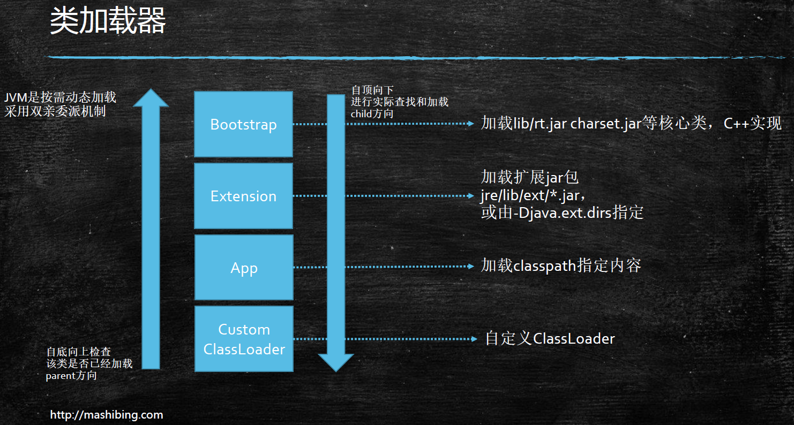
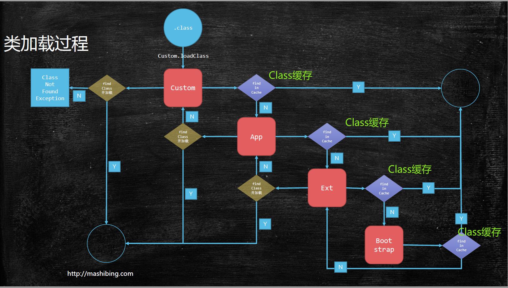

类加载-初始化
---
Method Area 方法区 保存常量/class对象信息等
* 1.8之前 Perm Generation 永久区
* 1.8之后 Meta space 元空间
## Loading

### Class加载器
* Bootstrap 加载核心类 **顶级**

  对应加载路径:`sun.boot.class.path`

  `System.out.println(String.class.getClassLoader());`  
  
  输出 `null`
* Extension 加载扩展包

  对应加载路径:`java.ext.dirs`

  `System.out.println(sun.net.spi.nameservice.dns.DNSNameService.class.getClassLoader())`

  输出 `sun.misc.Launcher$ExtClassLoader@677327b6`
* App 加载classpath指定内容

  对应加载路径:`java.class.path`

  `System.out.println(T002_ClassLoaderLevel.class.getClassLoader());`

  输出 `sun.misc.Launcher$AppClassLoader@18b4aac2`
* Custom ClassLoader  自定义加载器
### 双亲委派

* 主要是为了安全 防止篡改
* 向上找 向下委托
* 从子到父查询Class是否已经被加载到缓存中 再从父到子逐层判断加载Class
* 父加载器不是“类加载器的加载器”！！！！！也不是“类加载器的父类加载器”  **不要和语法父类的概念混淆**

  父加载器从高到底的顺序:
  > Bootstrap -> Extension -> App -> Custom ClassLoader
### ClassLoader源码

执行逻辑: 
1. ClassLoader.loadClass 加载某一个Class ①
1. findLoadedClass 判断缓存中查找是否已经加载Class,如果找不到执行父加载器 ②
1. parent.loadClass 执行父加载器委派过程 ③
1. 父加载器 findClass()依然为空 抛出`ClassNotFoundException` 
1. 但是对父加载器的`ClassNotFoundException`不做处理 默认为父加载器没有对应Class信息
1. findClass() 当前加载器查找Class

> current.findInCache -> parent.loadClass -> current.findClass()
```java
protected Class<?> loadClass(String name, boolean resolve)// ①
    throws ClassNotFoundException
{
    synchronized (getClassLoadingLock(name)) {
        Class<?> c = findLoadedClass(name);//② 在当前加载器缓存中查找Class信息
        if (c == null) {
            long t0 = System.nanoTime();
            try {
                //③ 判断是否要升级到父加载器中 加载Class
                if (parent != null) {
                    c = parent.loadClass(name, false);//从父加载器查找 App -> Extension
                } else {
                    c = findBootstrapClassOrNull(name);//从Bootstrap加载器查找
                }
            } catch (ClassNotFoundException e) {
              //处理父加载器抛出的ClassNotFoundException异常 什么都不做
            }

            if (c == null) {
                long t1 = System.nanoTime();
                c = findClass(name);//父加载器查找结果都为空, 在当前加载器查找Class
                sun.misc.PerfCounter.getParentDelegationTime().addTime(t1 - t0);
                sun.misc.PerfCounter.getFindClassTime().addElapsedTimeFrom(t1);
                sun.misc.PerfCounter.getFindClasses().increment();
            }
        }
        if (resolve) {
            resolveClass(c);
        }
        return c;
    }
}
```
### 自定义类加载器
1. 继承 `ClassLoader` 
1. 重写模板方法` findClass()` 调用` defineClass(byte[] -> Class clazz)`

```java
public class T006_MSBClassLoader extends ClassLoader {
    @Override
    protected Class<?> findClass(String name) throws ClassNotFoundException {
        File f = new File("c:/test/", name.replace(".", "/").concat(".class"));
        try {
            FileInputStream fis = new FileInputStream(f);
            ByteArrayOutputStream baos = new ByteArrayOutputStream();
            int b = 0;

            while ((b=fis.read()) !=0) {
                baos.write(b);
            }

            byte[] bytes = baos.toByteArray();
            baos.close();
            fis.close();//可以写的更加严谨

            return defineClass(name, bytes, 0, bytes.length);
        } catch (Exception e) {
            e.printStackTrace();
        }
        return super.findClass(name); //throws ClassNotFoundException
    }
}
```
作用:
1. 加密Class 防止反编译 防止篡改
1. 热启动，热部署
### 混合执行 编译执行 解释执行
* 解释器 `bytecode intepreter` 解释执行
* JIT `Just In-Time compiler` 编译执行
* 混合模式
  1. 使用解释执行+ 热点代码编译执行
  1. 起始阶段采用解释执行
  1. 热点代码检测
      * 多次被调用的方法(方法计数器: 检测方法执行频率)
      * 多次被调用的循环(循环计数器: 检测循环执行频率)
      * 热点代码编译
* `-Xmixed` 默认为混合模式 开始解释执行 启动速度较快 对热点代码实行检测和编译
  > 检测热点代码：`-XX:CompileThreshold = 10000`
* `-Xint` 使用解释模式 启动很快 执行稍慢
* `-Xcomp` 使用纯编译模式 执行很快 启动很慢
## Linking
## Initializing