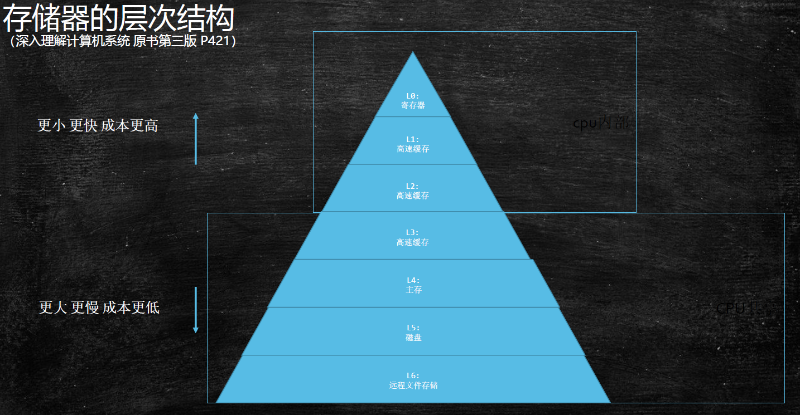

JMM - memory model  `内存模型`
---
## 硬件层数据一致性
### 存储器的层次结构

* Cpu 内部包含:
  1. L0 :寄存器
  1. L1 :高速缓存
  1. L2 :2级高速缓存
  
      *L1和L2缓存都是每个CPU一个*
* Cpu 共享:
  1. L3 :3级高速缓存 *多个核心共用一个*
  1. L4 :内存
  1. L5 :硬盘
  1. L6 :远程文件存储
* 访问速度的区别
  |从CPU到|CPU周期|大约需要的时间|
  |-|-|-|
  |寄存器|1 cycles||
  |L1 cache|3-4 cycles|1ns|
  |L2 cache|10 cycles|3ns|
  |L3 cache|25 cycles|15ns|
  |Main Memory(主存)|100 cycles|80ns|
参考: [细说Cache-L1/L2/L3/TLB](https://zhuanlan.zhihu.com/p/31875174)
### 总线锁 bus lock

### MESI Cache 缓存一致性协议

也称为 : 伊利诺斯协议

[多线程之:MESI－CPU缓存一致性协议](https://www.cnblogs.com/z00377750/p/9180644.html)

* MESI协议中的状态

  CPU中每个缓存行`caceh line`使用4种状态进行标记`使用额外的两位(bit)表示`:

  * M: 被修改`Modified`

    该缓存行只被缓存在该CPU的缓存中,并且是被修改过的`dirty`,即与主存中的数据不一致,该缓存行中的内存需要在未来的某个时间点`允许其它CPU读取请主存中相应内存之前`写回`write back`主存.

    当被写回主存之后,该缓存行的状态会变成独享`exclusive`状态.

  * E: 独享的`Exclusive`

    该缓存行只被缓存在该CPU的缓存中,它是未被修改过的`clean`,与主存中数据一致.该状态可以在任何时刻当有其它CPU读取该内存时变成共享状态`shared`.

    同样地,当CPU修改该缓存行中内容时,该状态可以变成Modified状态.

  * S: 共享的`Shared`

    该状态意味着该缓存行可能被多个CPU缓存,并且各个缓存中的数据与主存数据一致`clean`,当有一个CPU修改该缓存行中,其它CPU中该缓存行可以被作废`变成无效状态(Invalid)`.

  * I: 无效的`Invalid`

    该缓存是无效的`可能有其它CPU修改了该缓存行`.
### 小结
硬件层数据一致性 协议很多; intel 用MESI

其它协议还有: MSI MESI MOSI Synapse Firefly Dragon 等

缓存锁不能解决所有情况; 有些无法被缓存的数据(数据量比较大),或者跨越多个缓存行的数据,依然必须使用总线锁

因此, 现代CPU的数据一致性实现 = 缓存锁`MESI ...` + 总线锁  
### Cache line 缓存行对齐 伪共享
* 读取缓存以Cache line为基本单位, 目前 `64 bytes`
* 伪共享: 位于同一缓存行的两个不同数据, 被两个不同CPU锁定, 产生相互影响的伪共享问题
* 缓存行对齐 (long类型对齐)

  参考: `JUC/c_028_FalseSharing/T02_CacheLinePadding`
  ```java
  private static class Padding {
      public volatile long p1, p2, p3, p4, p5, p6, p7;
  }

  private static class T extends Padding {
      public volatile long x = 0L;//这样以来 x 就不会和其它变量在同一缓存行 
  }
  ```

  > 使用缓存行的对齐能够提高效率 提高了多线程操作访问的效率, 避免了为了保证缓存一致性带来的消耗

  disruptor 环形缓冲队列框架有使用到缓存对齐的方式
## 乱序问题

  CPU为了提高指令执行效率, 会在一条指令执行过程中(比如去内存读取数据(慢100倍)), 去同时执行另一条指令, 前提是: 两条指令没有依赖关系

  对于现代cpu而言,性能瓶颈则是对于内存的访问. cpu的速度往往都比主存的高至少两个数量级.

### 合并写技术
参考: [现代cpu的合并写技术对程序的影响](https://www.cnblogs.com/liushaodong/p/4777308.html)

WCBuffer 合并写缓存 (write combining)

WCBuffer 大小为4个byte

参考: `JUC/c_029_WriteCombining/WriteCombining`
  ```java
  public static long runCaseOne() {
      long start = System.nanoTime();
      int i = ITERATIONS;
      while (--i != 0) {
          int slot = i & MASK;
          byte b = (byte) i;
          arrayA[slot] = b;
          arrayB[slot] = b;
          arrayC[slot] = b;
          arrayD[slot] = b;
          arrayE[slot] = b;
          arrayF[slot] = b;
      }
      return System.nanoTime() - start;
  }
  public static long runCaseTwo() {
      long start = System.nanoTime();
      int i = ITERATIONS;
      while (--i != 0) {
          int slot = i & MASK;
          byte b = (byte) i;
          arrayA[slot] = b;
          arrayB[slot] = b;
          arrayC[slot] = b;
      }
      i = ITERATIONS;
      while (--i != 0) {
          int slot = i & MASK;
          byte b = (byte) i;
          arrayD[slot] = b;
          arrayE[slot] = b;
          arrayF[slot] = b;
    }
      return System.nanoTime() - start;
  }
  ```

  > Intel AMD 虽然都是X86架构,但是运行结果却不一样; 在我本机(AMD R7 4800H )执行的结果 -- SingleLoop 快于 SplitLoop
  >
  > [stackoverflow相关的讨论](https://stackoverflow.com/questions/49959963/where-is-the-write-combining-buffer-located-x86)
### 证明乱序  
[内存重新排序的行为](https://preshing.com/20120515/memory-reordering-caught-in-the-act/)

参考: `JVM/c3_jmm/T04_Disorder`
  ```java
  for(;;) {
      i++;
      x = 0; y = 0;
      a = 0; b = 0;
      Thread one = new Thread(new Runnable() {
          public void run() {
              //由于线程one先启动,下面这句话让它等一等线程two. 读着可根据自己电脑的实际性能适当调整等待时间.
              shortWait(100000);
              //下面两行代码执行顺序可能被打乱
              a = 1;
              x = b;
          }
      });
      Thread other = new Thread(new Runnable() {
          public void run() {
              //下面两行代码执行顺序可能被打乱
              b = 1;
              y = a;
          }
      });
      one.start();other.start();
      one.join();other.join();
      String result = "第" + i + "次 (" + x + "," + y + "）";
      if(x == 0 && y == 0) {
          System.err.println(result);
          break;
      } else {
          //System.out.println(result);
      }
  }
  ```
  > 如果没有乱序执行的情况 x,y的状态只有三种: (0,1) (1,0) 和(1,1)
  >
  > 但是如果出现了乱序执行的情况 x,y 会出现第四种情况: (0,0) `x = b; y = a` 先执行
### 总结
读可乱序, 写可合并
* 读指令的同时可以同时执行 _不影响的其它指令_
* 写指令的同时可以进行 _合并写_
## 如何保证特定情况下不乱序
### 硬件内存屏障 `barrier` (这里特指 `x86架构`)
  1. `sfence`: store fence 写屏障 在`sfence`指令前的写操作当必须在`sfence`指令后的写操作前完成.
  1. `lfence`: load fence 读屏障 在`lfence`指令前的读操作当必须在`lfence`指令后的读操作前完成.
  1. `mfence`: modify fence 在`mfence`指令前的读写操作当必须在`mfence`指令后的读写操作前完成. 全能屏障
  1. 原子指令, 如 x86上的`lock...` 指令是一个Full Barrier,执行时会锁住内存子系统来确保执行顺序,甚至跨多个CPU.Software Locks通常使用了内存屏障或原子指令来实现变量可见性和保持程序顺序
### JVM级别如何规范(JSR133)  
  1. LoadLoad屏障:
    
      对于这样的语句 `Load1; LoadLoad; Load2,` 
  
      在Load2及后续读取操作要读取的数据被访问前, **保证Load1要读取的数据被读取完毕.**
 
  1. StoreStore屏障:
 
      对于这样的语句 `Store1; StoreStore; Store2,`
    
      在Store2及后续写入操作执行前, **保证Store1的写入操作对其它处理器可见.** 
 
  1. LoadStore屏障:
 
      对于这样的语句 `Load1; LoadStore; Store2,`
    
      在Store2及后续写入操作被刷出前, **保证Load1要读取的数据被读取完毕.** 
 
  1. StoreLoad屏障: 全能屏障

      对于这样的语句 `Store1; StoreLoad; Load2,`
      
      在Load2及后续所有读取操作执行前, **保证Store1的写入对所有处理器可见.**
### volatile实现细节
* 字节码层面

  ACC_VOLATILE 访问修饰符为 VOLATILE
  参考: JVM/c3_jmm/TestVolatile.java

  ```java
  public class TestVolatile {
      int i;
      volatile int j;
  }

  //编译层面
  Name:       cp_info_#6 <j>
  Descriptor: cp_info_#5 <I>
  Access flags: 0x0040 [volatile]
  ```
* JVM层面

  volatile 内存区的读写 都加屏障
  ```
  StoreStoreBarrier          LoadLoadBarrier
  -----------------         -----------------
  volatile 写操作             volatile 读操作
  -----------------         -----------------
  StoreLoadBarrier           LoadStoreBarrier
  ```
* 操作系统硬件层面  

  使用 `hsdis` - HotSpot Dis Assembler 虚拟机(字节码)反汇编工具

  参考: [volatile 与 lock 前缀指令](https://blog.csdn.net/qq_26222859/article/details/52235930)

  windows系统下 使用 `lock` 后续多条指令实现
### synchronized实现细节
* 字节码层面
  1. sync整个方法
      ```java
      synchronized void m() {
      }
      ```
      字节码: `Access flags: 0x0020 [synchronized]`
  1. sync代码块
      ```java
      void n() {
        synchronized (this) {
        }
      }
      ```
      通过JVM指令: `monitorenter` `monitorexit` ;对象监视器 进入与退出
* JVM层面
  
  C/C++ 调用了操作系统提供的同步机制
* OS和硬件层面
  
  x86: lock compxchg xxxx  比较并交换指令

### 参考
* [Java使用字节码和汇编语言同步分析volatile，synchronized的底层实现](https://blog.csdn.net/21aspnet/article/details/88571740)