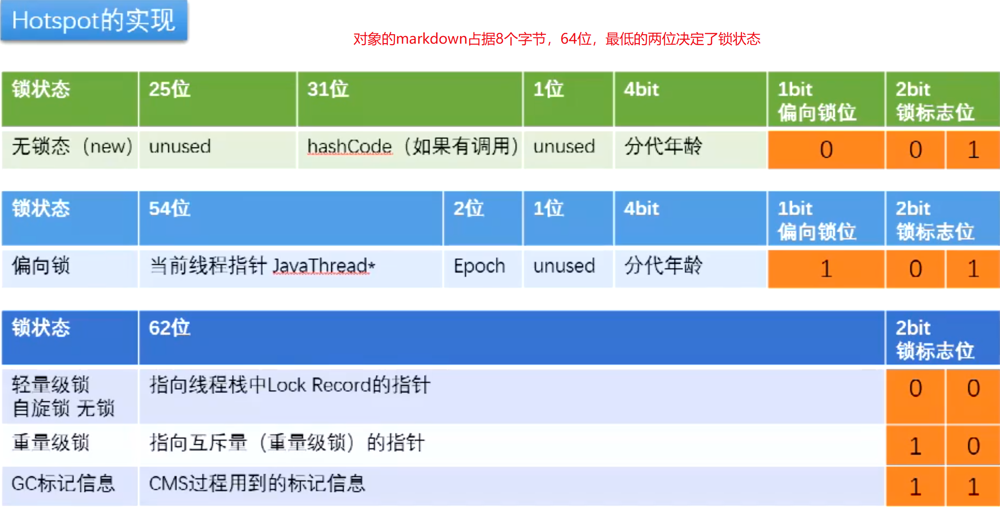
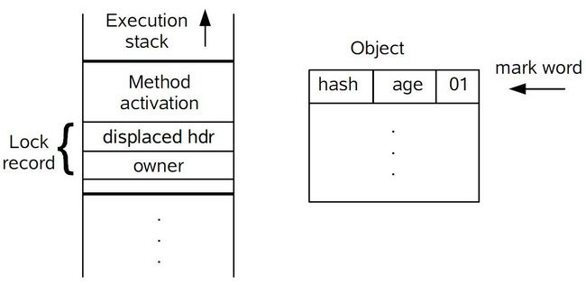
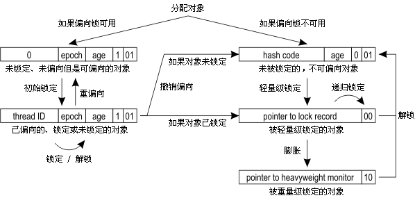
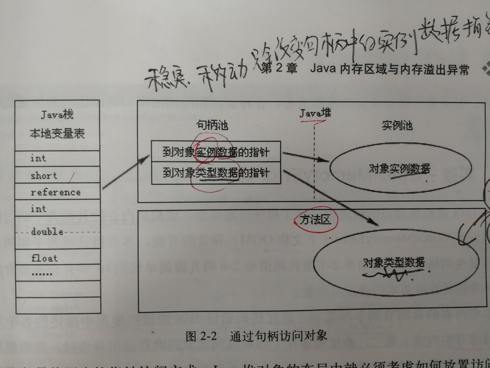
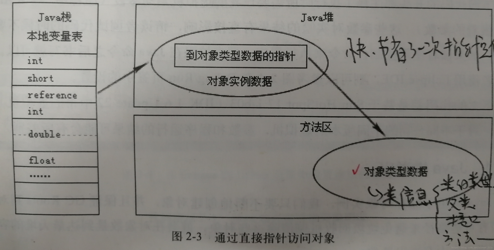

对象的内存布局
---
## 一个面试题
1. 请解释一下对象的创建过程?
1. 对象在内存中的存储布局?  
    • JavaAgent_AboutObject.md
1. 对象头具体包括什么?
    
    • JavaAgent_AboutObject.md
1. 对象怎么定位?
  
    • [句柄和直接指针](https://blog.csdn.net/clover_lily/article/details/80095580)
1. 对象怎么分配?
    
    • GC 相关内容
1. Object o = new Object 在内存中占用多少字节?
    
    • JavaAgent_AboutObject.md
## 对象的创建过程
1. class loading
1. class linking
    * verification 校验
    * preparation 准备(静态变量赋初始)
    * resolution 决定(将类 方法, 属性等符号引用解析为直接引用)
1. class initializing
1. 申请对象内存
1. 成员变量赋默认值
1. 调用构造函数 `<init>`
    * 成员变量顺序赋初始值
    * 执行构造方法语句
## 对象在内存中的存储布局
### 观察虚拟机配置
`java -XX:+PrintCommandLineFlags -version`
### 普通对象
1. 对象头

    `markword` 8 字节
1. ClassPointer 指针

    `-XX:+UseCompressedClassPointers` 开启Class指针压缩 4字节,默认开启; 不开启压缩 8 字节
1. 实列数据

    `-XX:+UseCompressedOops` 开启普通对象指针压缩 4字节,默认开启; 不开启压缩 8字节

    Oops : Ordinary Object Pointers
1. Padding 对齐填充, 8的倍数
### 数组对象
1. 对象头

    `markword` 8 字节
1. ClassPointer 指针

    `-XX:+UseCompressedClassPointers` 开启Class指针压缩 4字节,默认开启; 不开启压缩 8 字节
1. 数组长度 4 字节
1. 数组数据
1. Padding 对齐填充, 8的倍数
## 对象的大小实验 Object o = new Object 在内存中占用多少字节
* ObjectSizeAgent 工程
  
  gradle配置 manifest属性
    ```
    task fooJar(type: Jar){
        from sourceSets.main.output
        manifest{
            attributes (
                    'Premain-Class':'com.milk36.agent.ObjectSizeAgent'
            )
        }
    }
    ```
* 启动 JVM参数
  
  `-javaagent:D:\IdeaProjects\learnProjects\JavaExample\java-questions\libs\ObjectSizeAgent-0.0.1.jar`
* 测试对象
  ```java
  //-XX:+UseCompressedClassPointers 开启class指针压缩
  //-XX:+UseCompressedOops 开启普通对象指针压缩
  // Oops = ordinary object pointers
  static class TestObj{
                    //8 mark-word
                    //4 class-pointer
    int i;          //4
    String name;    //4 ref
    double k;       //8
    long l;         //8
    byte b1;        //1
    char c1;        //2
    short s1;       //2
  }
  ```
  > TestObj 大小为41; 对齐 8的倍数 =>48
  >
  > `-XX:-UseCompressedClassPointers -XX:-UseCompressedOops` 关闭Class指针和普通对象指针的压缩 41+8=49 ;对齐 =>56
### Hotspot开启内存压缩的规则（64位机）
1. 4G以下，直接砍掉高32位
1. 4G - 32G，默认开启内存压缩 ClassPointers Oops
1. 32G，压缩无效，使用64位

    内存并不是越大越好（^-^）
## 对象头具体包括什么
### markword 64位



<style>
table, th, td {
   border: 1px solid black;
}
</style>
* 无锁态
  |锁状态|25 bit|31 bit|1 bit|4 bit|1 bit <br/>偏向锁位|2 bit <br/>锁标志位|
  |-|-|-|-|-|:-:|:-:|
  |无锁态(new)|unused|hashCode|unsed|分代年龄|0|01|
* 偏向锁  
  |锁状态|54 bit|2 bit|1 bit|4 bit|1 bit <br/>偏向锁位|2 bit <br/>锁标志位|
  |-|-|-|-|-|:-:|:-:|
  |偏向锁|当前线程指针 JavaThread ID|Epoch|unsed|分代年龄|1|01|
* 轻量锁 重量锁 GC
  |锁状态|62 bit|2 bit <br/>锁标志位|
  |---|---|:---:|
  |轻量级锁(自旋锁,无锁)|指向线程栈中Lock Record的指针|00|
  |重量级锁|指向互斥(重量级锁)的指针|10|
  |GC标记信息|CMS过程用的的标记信息|11|

* **偏向锁** 升级成 **轻量级锁** 之后 *分代年龄* 去哪里了？  
  
  
  
  

  > 虚拟机首先将在当前线程的 **栈帧** 中建立一个名为锁记录（Lock Record）的空间，用于存储锁对象目前的Mark Word的拷贝，然后拷贝对象头中的Mark Word复制到锁记录中。

  > 拷贝成功后，虚拟机将使用CAS操作尝试将对象的Mark Word更新为指向Lock Record的指针，并将Lock Record里的owner指针指向对象的Mark Word。

  参考:[不可不说的Java“锁”事 -- 美团技术团队](https://tech.meituan.com/2018/11/15/java-lock.html)
### 为什么GC年龄默认为15?
因为分代年龄只有4bit; 所以最多只有15
### IdentityHashCode的问题
* 偏向锁延迟启动

  偏向锁默认不是立即就启动的，在程序启动后，通常有几秒的延迟，
  
  可以通过命令 `-XX:BiasedLockingStartupDelay=0` 来关闭延迟。
* 偏向锁升级过程

  
* 31 位 hashCode
  
  `System.identityHashCode(Object x)` 原始hashCode计算 ,永远返回根据对象物理内存地址产生的hash值

  默认调用的是 `os::random` 产生hashCode

  重写过的hashCode方法计算的结果不会存在这里

  > 如果调用了对象的 `hashCode()` 函数, 就不会进入偏向锁状态

* 回答白马非马的问题：

  当一个对象计算过identityHashCode之后，不能进入偏向锁状态

  参考:

  [死磕Synchronized底层实现](https://cloud.tencent.com/developer/article/1480590)

  [Synchronized底层实现](https://cloud.tencent.com/developer/article/1484167)

  [死磕Synchronized底层实现--重量级锁](https://cloud.tencent.com/developer/article/1485795)

  [读懂Synchronized底层实现](https://cloud.tencent.com/developer/article/1482500)
## 对象怎么定位
就HotSpot而言，他使用的是 *直接指针* 访问方式进行对象访问
* 句柄池

  
* 直接指针
  
  
  `reference`中直接存储的就是对象地址

  使用直接指针方式最大的好处就是速度更快，他节省了一次指针定位的时间开销。
## 对象怎么分配

  

* TLAB: 全称Thread Local Allocation Buffer, 即：线程本地分配缓存。这是一块线程专用的内存分配区域。

