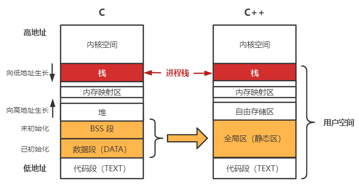
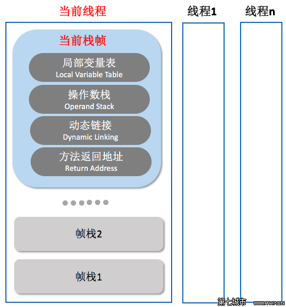
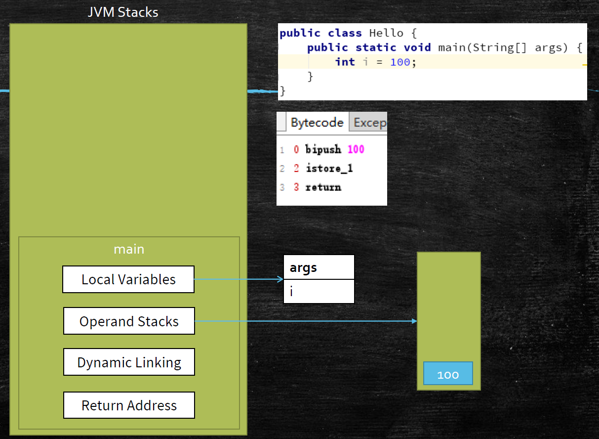
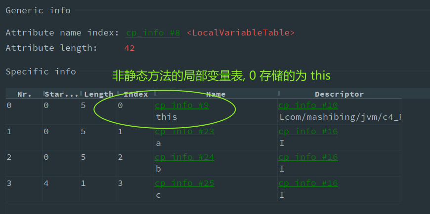

Java 运行时数据区 和 指令集
---
## Linux 进程内存分布


* Linux系统默认内核空间 1GB(32位)
* 同一进程下的线程是共享 **进程堆空间** 的
## Run-Time Data Areas 运行时数据区

JVM 运行时数据区:


JVM 栈帧:



[Java SE 18 Run-Time Data Areas](https://docs.oracle.com/javase/specs/jvms/se18/html/jvms-2.html#jvms-2.5)
### Program Counter 程序计数器
PC 程序计数器

> 每个 Java 虚拟机线程都有自己的 pc（程序计数器）寄存器。在任何时候，每个 Java 虚拟机线程都在执行单个方法的代码，即该线程的当前方法
```
存放指令位置
虚拟机的运行, 类似与这样的循环:
while(not end){
  取PC中的位置, 找到对应的位置指令;
  执行指令;
  PC++;
}
```
### JVM Stacks 虚拟机栈 (VMS)


> 每个 Java 虚拟机线程都有一个私有的Java 虚拟机堆栈，与线程同时创建。
>
> 线程栈 -> 方法栈帧
* Frame - 每个方法对应一个*栈帧*


  方法栈帧 用于 存储数据和部分结果，以及执行动态链接、方法返回值和调度异常。

  每次调用方法时都会创建一个 *新栈帧*。栈帧在其方法调用完成时被销毁，无论该完成是正常的还是突然的异常（它会引发未捕获的异常）
  1. Local Variables Table 局部变量表

      > 局部变量表类似 CPU中的 **寄存器** 的作用

      每个帧包含一个变量数组，称为局部变量; 局部变量就是当前方法内使用的变量
      ```java
      public void add(int a, int b) {
        int c = a + b;
      }
      ```
      对应的局部变量表:

      
      
      > 非静态方法的第0个局部变量为`this`
  1. Operand Stacks 操作数栈

      操作数栈就相当于C语言中的 **栈帧** 用于压入对应字节码操作指令 先进后出原则 FILO

      操作码 + 操作数
  1. Dynamic Linking 动态链接

      直接连接到 `constant_pool` 常量池的符号链接

      [java动态链接：动态链接是一个将符号引用解析为直接引用的过程。java虚拟机执行字节码时，遇到一个操作码，操作码第一次使用一指向另一类的符号引用，则虚拟机就必须解析这个符号引用。解析时需要执行三个基本的任务：](https://blog.csdn.net/q_41813060/article/details/88379473)

      1. 查找被引用的类(有必要的话就装载它，一般采用延时装载)。

      1. 将符号引用替换为直接引用，这样当再次遇到相同的引用时，可以使用这个直接引用，省去再次解析的步骤。

      1. 当java虚拟机解析一个符号引用时，class文件检查器的第四趟扫描确保了这个引用时合法的。
      
  1. return address 返回值地址
      
      a() -> b()，方法a调用了方法b, b方法的返回值放在什么地方
* 测试代码
  ```java
  public class TestIPulsPlus {
    public static void main(String[] args) {
        int i = 8;
        i = i++;//情况 1
        //i = ++i;//情况 2
        System.out.println(i);
    }
  }
  //i++ JVM字节码指令 (情况 1)
  0 bipush 8   //压栈 8 
  2 istore_1   //取出栈顶数据 保存到 1位置局部变量 这里的效果: int i = 8
  3 iload_1    //从局部变量1位置 拿出 压栈: i = 8
  4 iinc 1 by 1 //局部变量表1位置 加 1 局部变量表:i = 9
  7 istore_1    //取出栈顶数据 保存到 1位置局部变量 : i = 8
  8 getstatic #2 <java/lang/System.out : Ljava/io/PrintStream;>
  11 iload_1
  12 invokevirtual #3 <java/io/PrintStream.println : (I)V>
  15 return

  //++i JVM字节码指令 (情况 2)
  0 bipush 8      //压栈 8 
  2 istore_1      //取出栈顶数据 保存到 1位置局部变量 这里的效果: int i = 8
  3 iinc 1 by 1   //局部变量表1位置 加 1 局部变量表:i = 9
  6 iload_1       //从局部变量1位置 拿出 压栈: i = 9
  7 istore_1      //取出栈顶数据 保存到 1位置局部变量 : i = 9
  8 getstatic #2 <java/lang/System.out : Ljava/io/PrintStream;>
  11 iload_1
  12 invokevirtual #3 <java/io/PrintStream.println : (I)V>
  15 return
  ```    
### Heap 堆内存
> Java 虚拟机有一个在所有 Java 虚拟机线程之间共享的堆。堆是为所有类实例和数组分配内存的运行时数据区域。
### Method Area 方法区
> 方法区类似于传统语言的编译代码的存储区，或者类似于操作系统进程中的“文本”段。它存储每个类的结构，例如运行时常量池、字段和方法数据，以及方法和构造函数的代码，包括类和接口初始化以及实例初始化 中使用的特殊方法。
1. Perm Space 永久区(JDK < 1.8)
  
    字符串常量位于 `PermSpace`

    FullGC不会清理(这里会产生OOM异常)

    大小启动的时候指定, 不能变
1. Meta Space 元空间(JDK >= 1.8)  
  
    字符串常量位于堆

    会触发FullGC清理

    不设定的话, 最大就是物理内存
### Runtime Constant Pool  运行时常量池
> 运行时常量池是文件中表的按类或按接口运行时表示
### Native Method Stacks 本地方法栈 (NMS)
> Java 虚拟机的实现可以使用传统的堆栈，通俗地称为“C 堆栈”，以支持native方法
### Direct Memory 直接内存
> JVM 可以直接访问的内核空间内存(OS管理的内存)
>
> NIO , 提高效率, 实现 zero copy
## Instruction Set 指令集
* CISC - complex instruction set computer(复杂指令集) 

  机器的存储器操作指令多，操作直接。
* RISC - reduced instruction set computer(精简指令集)

  对存储器操作有限制，使控制简单化。
* 相关概念
  * 指令正交(向量) 正交设计

    指令正交(X,Y轴夹角为90度,完全正交) 则说明两条指令功能完全独立,没有重叠功能(没有任何交集)
  * 投影 反正交设计
  * 现实中 CISC内部也包含了 RISC, RISC也包含了CISC, 两者之间并非完全正交

* 操作码 + 操作数
* 基于栈的指令集 如:JVM
* 基于寄存器的指令集 如:汇编 硬件层面
* Hotspot中的Local Variable Table(局部变量表) = JVM中的寄存器
### 常用指令说明
<style>
red { color: red }
green { color: green }
</style>
> n 是当前帧的局部变量表的索引。
* istore_n

  `istore_1` 将 int 存储到局部变量 n 中; <font color=green>出栈</font>
* iload_n

  `iload_1` 从局部变量 n 加载 int 值; <font color=red>压栈</font>
* astore_n

  `astore_1` 将引用存储到局部变量 n 中; <font color=green>出栈</font>
* aload_n

  `aload_1` 从局部变量 n 加载引用 ; <font color=red>压栈</font>
* bipush 

  `bipush 100` 压入 `byte` 字节 <font color=red>压栈</font>
* sipush  

  `sipush 300` 压入 `short` 字节 <font color=red>压栈</font>
* iadd

  相加 int; value1 和 value2 都必须是 int 类型。 value1 和 value2 从操作数堆栈中弹出。<green>出栈</green>
  
  int 结果是 value1 + value2。result 被压入操作数堆栈。<red>压栈</red>
  
* new

  创建新对象 如果尚未初始化，则将其初始化 
  
  初始化赋值 如:`byte、short、int、long =0 `; `float =0.0f double = 0.0d`
* dup  

  `Duplicate` 复制顶部操作数堆栈值

  复制操作数堆栈上的顶部值并将复制的值压入操作数堆栈。<red>压栈</red>
* invokespecial

  调用实例方法；直接调用实例初始化方法和当前类及其超类型的方法

  如调用构造方法:`invokespecial #3 <com/mashibing/jvm/c4_RuntimeDataAreaAndInstructionSet/Hello_02.<init> : ()V>`
* iconst_i

  `iconst_1` 将 int 常量 <i>（-1、0、1、2、3、4 或 5）压入操作数堆栈 <red>压栈</red>。
* if_icmp<cond>

  if int 比较成功则分支

  条件: `eq` value1 = value2 ; `ne` value1 ≠ value2 ;`lt` value1 < value2; `le` value1 ≤ value2 等等...

  `if_icmpne 7 (+5)` value1 和 value2 不等则跳转第 7 个指令; value1 和 value2 都被弹出栈  <green>出栈</green>
* isub

  减去整数

  value1 和 value2 都必须是 int 类型。value1 和 value2 从操作数堆栈中弹出 <green>出栈</green>。 
  
  int 结果是 value1 - value2。result 被压入操作数堆栈 <red>压栈</red>。
* imul

  乘 int

  value1 和 value2 都必须是 int 类型。value1 和 value2 从操作数堆栈中弹出 <green>出栈</green>。
  
  int 结果是 value1 * value2。result 被压入操作数堆栈。<red>压栈</red>。
* return  

  从方法返回 void
* ireturn

  从方法返回 int
### invoke 类型指令
* invokestatic

  调用类（静态）方法
* invokevirtual

  调用实例方法；基于类(多态)的调度
* invokeinterface

  调用接口方法
* invokespecial

  调用实例方法；直接调用实例初始化方法和当前类及其超类型的方法

  可以直接定位，不需要多态的方法
  
  private 方法 ， 构造方法  `<init>`
* invokedynamic

  调用动态计算的调用站点 JVM最难的指令
  
  lambda表达式或者反射; 其它动态语言scala kotlin ;或者CGLib ASM 动态产生的class, 会用到的指令