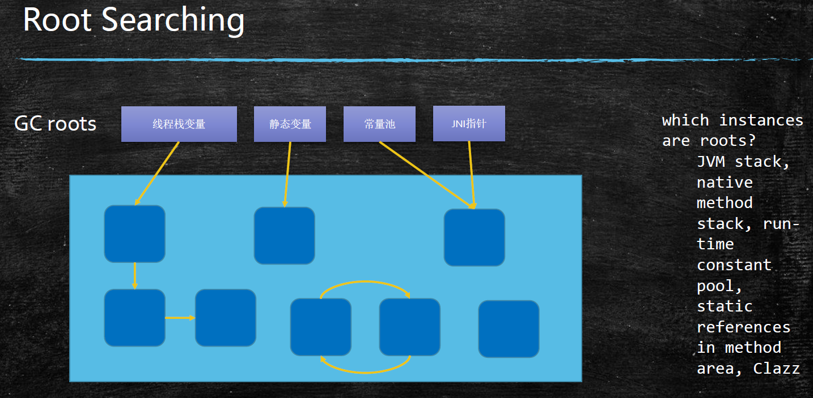
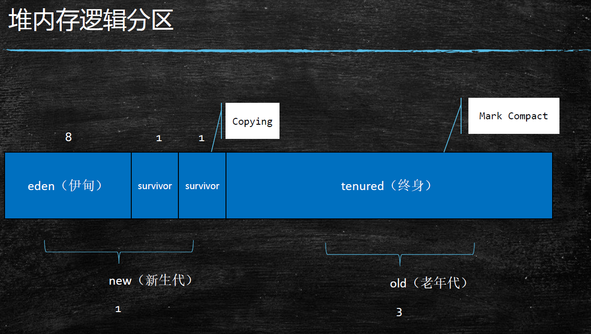
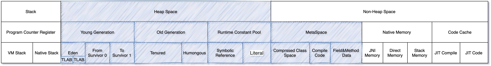
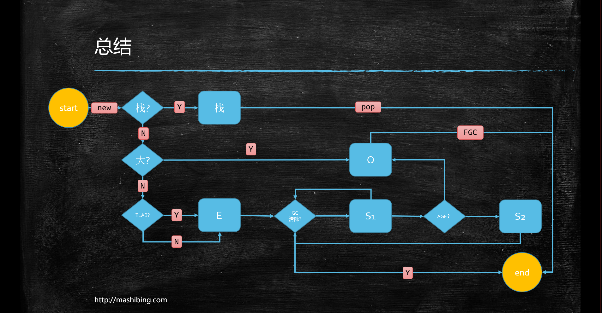
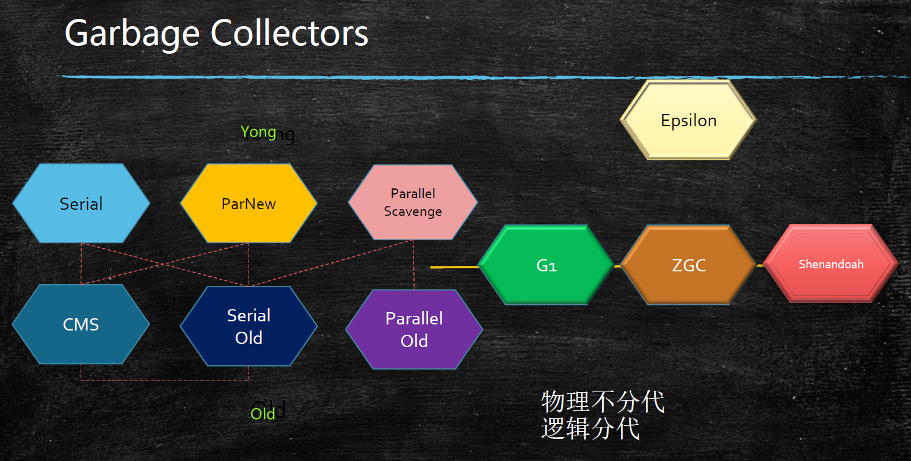
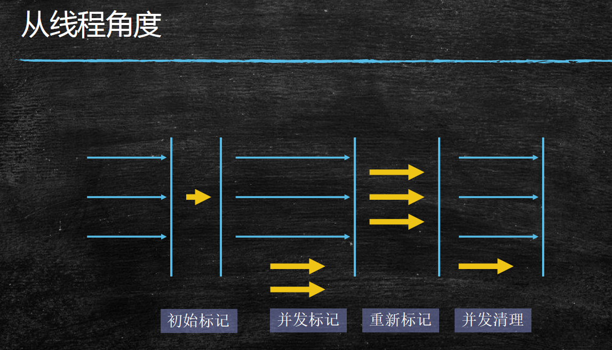

JVM GC概念
---
## Garbage Collector 垃圾回收
### 如何定位垃圾:
1. Refrence Count 引用计数器

    > 不好处理循环引用
1. Root Searching 根可达算法

    GC Roots: 线程栈变量 静态变量 常量池 JNI指针

    简单说就是程序启动马上就需要的对象

    
### GC常见的垃圾回收算法
* 标记清除 (mark sweep)

  第一次进行标记 ;第二次进行清除 (需要执行两次扫描) ; 适合 old 区

  位置不连续 容易产生碎片
* 拷贝算法 (copying) 

  没有碎片, 效率高, 内存消耗比较大(比较浪费内存空间)  适合 eden 区
* 标记压缩 (mark compact)

  没有碎片 ,没有内存浪费 , 效率比 copy略低 (需要执行两次扫描) ; 适合 old 区
### JVM 内存分代模型
* 部分垃圾回收器使用的模型

  除 Epsilon(用于测试) ZGC Shenandoah 之外的GC都是使用逻辑分代模型

  G1 是逻辑分代, 物理不分代

  除此之外不仅逻辑分代, 而且物理分代

  

  

  * new - young - Minor
    * 存活对象少
    * 使用Copy算法 效率高
  * old - Major
    * 垃圾少
    * 一般使用 标记压缩
    * g1 使用copy
  * java 1.8 默认 new/old 为 1/2
* 栈上分配
  * 线程私有的小对象
  * 无逃逸 如方法里的局部变量
    ```java
    public Person p;
    /**
     * 发生逃逸，对象被返回到方法作用域以外，被方法外部，线程外部都可以访问
     */
    public void escape(){
        p = new Person(26, "TomCoding escape");
    }

    /**
     * 不会逃逸，对象在方法内部
     */
    public String noEscape(){
        Person person = new Person(26, "TomCoding noEscape");
        return person.name;
    }
    static class Person {
      public int age;
      public String name;
    }  
    ```
  * 支持标量替换

    标量可以理解成一种不可分解的变量，如java内部的基本数据类型、引用类型等。 与之对应的聚合量是可以被拆解的，如对象。

    当通过逃逸分析一个对象只会作用于方法内部，虚拟机可以通过使用标量替换来进行优化。

    ```java
    /**
    * 不会逃逸，对象在方法内部
    * 把 Person 整个对象拆解散为基础类型
    */
    public String noEscape(){
        int age = 26;
        String name = "TomCoding noEscape";
        return name;
    }
    ```
    > 可以看到运行上面伪码之后，将不再从堆中分配内存创建Person对象，而是将成员变量分解作为栈帧中的局部变量。这样随着方法调用结束，栈帧也会销毁。有效的减少了堆中创建对象及gc次数
  * 无需调整

  以下JVM参数设置默认为开启:
  ```
  关闭逃逸分析: -XX:-DoEscapeAnalysis
  关闭标量替换: -XX:-EliminateAllocations
  关闭TLAB: -XX:-UseTLAB
  ```
* 线程本地分配 TLAB (Thread Local Allocation Buffer)
  * 每个线程都有独享一块内存, 占用eden区 , 默认 eden区 1%
  * 避免争用, 多线程的时候不用竞争eden就可以申请空间, 提高效率
  * 小对象
  * 无需调整

  默认情况下不需要对 栈上分配和 TLAB做调整
* 新生代 + 老年代 + `永久代(1.7) Perm Generation`/ `元数空间(1.8) Metaspace`
  1. 永久代 元数据 - Class信息
  1. 永久代必须制定大小限制, 设定大小JVM启动后不能修改; 元数据可以设置, 也可以不设置, 无上限(受限于物理内存)
  1. 字符串常量: 1.7 - 永久代; 1.8 - 堆
  1. `MethodArea` 逻辑概念 对应的实现: `永久代, 元数据`
* 新生代 = Eden + 2 个 `Suvivor` 区
  1. YGC回收之后, 大多数的对象会被回收, 存活的进入 `S0`
  1. 再次YGC, 活着的对象: `Eden + S0 -> S1`
  1. 再次YGC, `Eden + S1 -> S0`
  1. 年龄足够 -> 老年代 (分代年龄:16 CMS:6)
  1. `S区`装不下 -> 老年代
* 老年代 OLD
  1. 顽固份子
  1. 老年代满了 FGC -> FULL GC
* 大对象
### 对象何时进入老年代
* 超过 `XX:MaxTenuringThreshold` 指定次数 (YGC)
  * Markword 对象头的 分代年龄(GCAge) 只有4 bit 最大 15
  * Parallel Scavenge: 15
  * CMS: 6
  * G1: 15
* 动态年龄
  * s1 (YGC)-> s2 内存占用超过50% 

    如果在Survivor空间中相同年龄所有对象大小的总和大于Survivor空间的一半，年龄大于或等于该年龄的对象就可以直接进入老年代，无须等到MaxTenuringThreshold中要求的年龄。
  * 把年龄最大的放入 old区
  * 参考:[jvm误区--动态对象年龄判定](https://www.jianshu.com/p/989d3b06a49d)
* 分配担保:
   YGC期间 survivor区空间不够了 空间担保直接将Eden内的对象放入Old区; 再把新创建的对象就放入Eden
   参考：[JVM内存分配担保机制](https://cloud.tencent.com/developer/article/1082730)
> `动态年龄`和`分配担保` 可以初略的理解 都是在 `Eden`区内存占用较多(>50%)的情况下 直接将当前Eden存活对象直接升级到Old区的内存处理机制

### JVM内存分配的总结


1. `new`创建对象 尝试分配到栈上 如果可以入栈; 栈空间用完就可以直接丢弃 结束
1. 如果栈上分配不了 再判断对象大小, 如果比较大 直接分配到 `Old区` 最后 FGC 结束, 否则进入 `TLAB`
1. 无论 TLAB是否开启都进入到了`Eden`区
1. `Eden`区 YGC 如果被清除 结束; 判断年龄是否足够进入`Old区`;不够 `S1 -> S2`循环
## 常见的垃圾回收器


> JDK 诞生时就有 Serial(串行)  ; 为了提高效率诞生了PS(并行); 为了配合CMS, 诞生了PN;
>
> CMS是1.4版本后期引入, CMS是里程碑式的GC, 它开启了并发回收的过程, 但是CMS毛病较多, 因此目前任何一个JDK版本默认都不是CMS;
>
> 并发垃圾回收是因为想要尽量减少STW(stop the world)
* STW (stop the world) 整个JVM停止 进行GC操作
* safe point 安全点 ;业务线程合适的停止点 如: 执行完`unlock`
### Serial - Serial Old 组合

  `MarkSweepCompact`(MSC) -> `Serial Old`是Serial收集器的老年代版本， 它同样是一个单线程收集器， 使用“标记-整理” 算法。 
  1. Serial 年轻代 (串行回收)

      拷贝算法 单线程 串行
  1. Serial Old 

      标记清除 单线程 串行 老年代
### PS - PO 组合 
很多JDK版本默认还是这个组合, *1.8 默认垃圾收集器* , STW的情况比较严重, _不适合大内存使用_
  1. Parallel Scavenge - PS 年轻代 (并行清零回收)

      拷贝算法 多线程 并行
  1. Parallel Old 

      标记压缩 多线程 并行 老年代
### ParNew - CMS 组合
  
  > PN + CMS + SerialOld(特殊情况下老奶奶出场), 适合管理20G以内的JVM内存

  1. ParNew 年轻代 配合CMS的并行回收器

      拷贝算法 多线程 并行 ; PS 的增强, 可以配合CMS一起使用
  1. ConcurrentMarkSweep CMS 老年代

      一个多并发 少暂停的回收器

      CMS 四个阶段:
      1. initial mark - 初始标记 STW

          找到 Roots 根对象 并标记出来

          这个过程STW时间很短
      1. concurrent mark - 并行标记

          并发标记时 是和业务线程同时运行的
      1. remark - 重新标记  STW

          由于上一个标记过程中是并发执行的 可能出现新垃圾或者以标记的垃圾被重新使用的情况; 因此需要重新标记;
          
          这个过程STW时间很短
      1. comcurrent sweep - 并发清理

          并发执行清理 是和业务线程同时运行的 ; 这个过程中还可能产生 *浮动垃圾*

      
### CMS 缺点
* Memory Fragmentation 内存碎片化 

  因为 CMS使用的是MarkSweep(标记清除) ,所以很容易产生碎片

  解决方案: 
    1. `-XX:UseCMSCompactAtFullCollection` 开启 FGC时使用标记压缩清理内存碎片 但会提高GC的性能损耗
    1. `-XX:CMSFullGCsBeforeCompaction` 经过多少次FGC才进行压缩, 默认为0
* Floating Garbage 浮动垃圾

  1. Concurrent Mode Failure:

      如果并发收集器无法在年老代填满之前完成不可达浮动垃圾对象的回收，或者如果年老代中可用的空闲空间块不能满足分配，那么应用程序将暂停，并在停止所有应用线程的情况下完成收集

      解决方案：降低触发CMS的阈值

  1. Promotion Failed 升级失败

      解决方案类似，保持老年代有足够的空间

      `–XX:CMSInitiatingOccupancyFraction` 默认:92% 产生FGC; 
      
      可以降低这个值，让CMS保持老年代足够的空间 留给浮动垃圾
* CMS 在特殊情况下(发生Promotion Failed,浮动垃圾)会启用`Serial Old`来执行垃圾回收操作 ; 这时候的GC性能就非常底, 停顿时间可能非常久(老太太一个人清扫天安门...)
* CMS 不适合太大的内存应用 *20G以下内存比较合适*
### G1
* 逻辑分代 物理没分代 而是内存分块
* 算法: 三色标记 + SATB
### ZGC
* Single Generation 就只有一个分代
* "分治"回收
* 算法: ColrePointers + 些屏障
### Shenandoah
* 算法：ColoredPointers + WriteBarrier
### Epsilon
java 11 才有, 用于Debug
### 垃圾收集器和内存大小的关系
1. Serial 几十M
1. PS 上百M - 几个G
1. CMS - 20G以内
1. G1 - 上百G
1. ZGC - 4T 到 16T