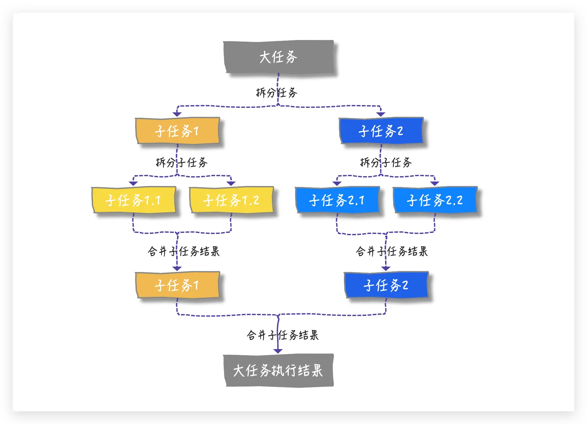
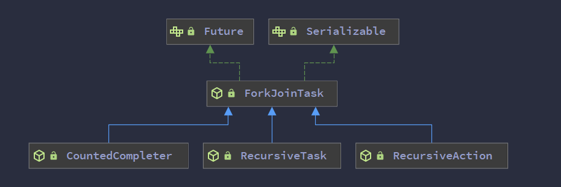
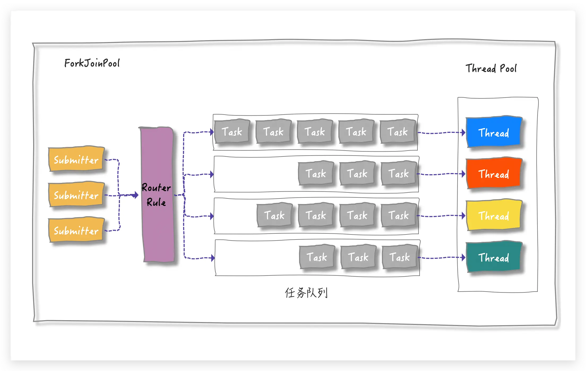
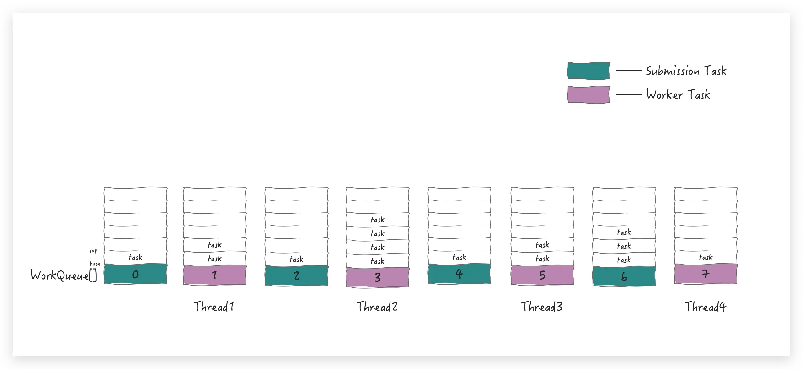
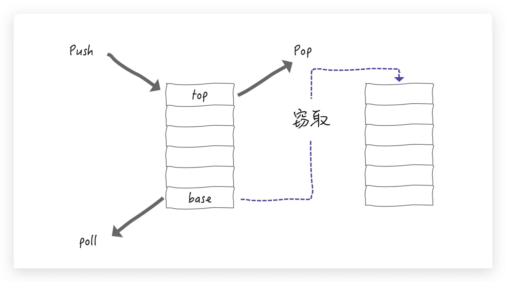

ForkJoinPool
===
## 功能 使用方式
> 分治 把大任务切分成一个一个的小任务去运行，小任务还是觉得比较大，再切，不一定是两个，也可以切成三个四个。切完这个任务执行完了要进行一个汇总

### 任务提交方法
* `void execute(ForkJoinTask<?> task)`

  提交任务执行(异步)
* `<T> ForkJoinTask<T> submit(ForkJoinTask<T> task)`

  提交 `ForkJoinTask` 以执行 , 后续可通过`join() get()`等方式获取计算结果
* `<T> T invoke(ForkJoinTask<T> task)`

  提交 `ForkJoinTask` 以执行 , 并等待返回计算结果 内部已经调用`task.join()`
### 任务对象


在实际运用中，我们一般都会继承 `RecursiveTask 、RecursiveAction` 或 `CountedCompleter` 来实现我们的业务需求，而不会直接继承 `ForkJoinTask` 类。
* `ForkJoinTask`

  在`ForkJoinPool`中运行的任务的抽象基类
* `RecursiveAction`

  一个没有结果的递归`ForkJoinTask` 比如排序操作
* `RecursiveTask`

  带有递归结果的`ForkJoinTask ` 比如打印斐波那契函数
  > <big>斐波那契数列</big>由0和1开始，之后的斐波那契数就是由之前的两数相加而得出
  > 
  > 又称黄金分割数列
  ```java
  //打印斐波那契数列  1-10
  ForkJoinPool pool = ForkJoinPool.commonPool();
  for (int i = 1; i <= 10; i++) {
    System.out.println("index:" + i + " result :" + pool.invoke(new FibTask(i)));
  }

  static class FibTask extends RecursiveTask<Integer>{
    int n;
    //计算出第N为数的斐波那契 数值
    public FibTask(int n) {
      this.n = n;
    }

    @Override
    protected Integer compute() {
      if (n <= 1) {//直到到不可再分解
        return  n;
      }
      FibTask f1 = new FibTask(n - 1);
      f1.fork();
      FibTask f2 = new FibTask(n - 2);
      return f2.compute() + f1.join();
    }
  }
  ```
* `CountedCompleter`

  在任务完成执行后会触发执行一个自定义的钩子函数
## 工作窃取算法 work stealing

每个线程拥有自己的队列

WorkQueue队列有两种
* 有外部直接提交的（submission task） 外部提交队列

  将 submission task 放到 WorkQueue 数组的「偶数」下标中
* 也有任务自己 fork 出来的（worker task） 工作窃取队列

  将 worker task 放在 WorkQueue 的「奇数」下标中，并且只有奇数下标才有<mark>线程( worker )</mark>与之相对



工作线程在处理自己的工作队列同时，会尝试窃取一个任务（可能是来自于刚刚提交到 pool 的任务，或是来自于其他工作线程的队列任务），此时可以把 WorkQueue 的数据结构视为一个 FIFO 的队列，窃取的任务位于其他线程的工作队列的队首（base位）

WorkQueue 就设计成了一个双端队列：

* 支持 LIFO(last-in-first-out 后进先出) 的push（放）和pop（拿）操作——操作 top 端
* 支持 FIFO (first-in-first-out 先进先出) 的 poll （拿）操作——操作 base 端



## WorkStealingPool
## 使用准则
* 使用尽可能少的线程池——在大多数情况下，最好的决定是每个应用程序或系统使用一个线程池
* 如果不需要特定的调优，使用默认的公共线程池 `ForkJoinPool.commonPool()`
* 使用合理的阈值将ForkJoinTask拆分为子任务
* 避免ForkJoinTasks中的任何阻塞